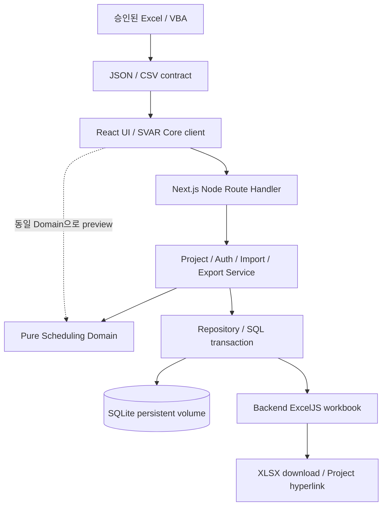

# Architecture draft

상태: Manager 통합 설계 초안. 구현·런타임 검증 전이다. 요구사항은 [REQUIREMENTS.md](REQUIREMENTS.md), 설계 판단은 [DECISIONS.md](DECISIONS.md)에서 관리한다.

## 경계



위 Repository→Export 화살표는 snapshot DTO 전달이다. Export Service가 조회를 조정하며 Repository가 ExcelJS를 import하지 않는다. 모든 persistence 접근은 Service 아래 Repository를 통한다.

| 영역 | 책임 | 금지하는 결합 | 최초 담당 |
| --- | --- | --- | --- |
| Frontend | Project UI, browser-only SVAR, unlock, preview, validation·loading·error, server 결과 반영 | DB/native module/secret import, UI 상태로 권한 판정 | frontend |
| Route | HTTP parse·size/content-type 제한·응답 | SQL과 scheduling 알고리즘 | backend |
| Service | Project authorization, validation, revision, transaction 조정, Domain 호출 | SVAR store를 진실의 원천으로 사용 | backend |
| Repository | bound SQL, scope, FK·snapshot·atomic persistence | business scheduling, workbook 생성 | backend |
| Domain | date/calendar, graph, summary/WBS, deterministic calculation | React, SVAR, DB, network, 현재 시각의 암묵 의존 | scheduler |
| Excel/VBA | Header mapping, 필요한 셀 정규화, JSON/CSV·오류 보고 | DRM 우회, backend schema 단독 변경 | excel_vba |
| Export | DB snapshot→Project/Tasks/Dependencies XLSX, Phase 2 Gantt | PRO export, token hyperlink | backend |
| Deployment | Node/native build, volume·permission·health·backup | image 안의 DB/secret, 다중 writer instance | infra |
| QA | 실제 계약과 결과의 독립 비교 | 구현 Agent 보고를 그대로 PASS 처리 | qa_docs |

## 제안 Directory 구조

아래는 구현 때 만들 구조이며 현재 존재하는 코드가 아니다.

```text
src/app/                         Next.js pages and HTTP routes
src/components/                  general UI
src/features/gantt/              SVAR client wrapper and adapters
src/features/import/             wizard, mapping, preview
src/server/services/             authorization and transaction orchestration
src/server/repositories/         SQL access
src/server/db/                   connection and migration runner
src/domain/scheduling/           pure domain and fixtures
src/contracts/                   validated API/import DTOs, no server imports
db/migrations/                  ordered SQL, no actual database
excel/vba/                      future approved VBA POC and exporter
tests/                          integration / browser / deployment evidence
docs/                           sources of truth and execution plan
```

`server-only` 경계와 dependency rules로 DB·crypto/session 모듈이 client bundle에 유입되지 않게 한다. Native driver를 쓰는 route는 Node runtime이다. Edge runtime과 serverless ephemeral filesystem은 초기 배포 대상이 아니다.

## Frontend와 SVAR

SVAR 공식 Next.js guide의 client wrapper, theme/CSS, `init` API를 따르고 browser mount/SSR 경계를 최소 POC로 검증한다. [공식 integration guide](https://docs.svar.dev/react/gantt/integration-guides/nextjs/setup/)

Project Direct page는 Readonly로 시작한다. Session 확인 또는 password unlock 성공 후 편집 UI를 활성화한다. 서버는 매 mutation에서 다시 권한을 확인한다. 기존 유효 session 재사용과 새 브라우저의 Readonly를 각각 시험한다.

UI는 공식 task/link/hierarchy editor를 우선 사용한다. Adapter가 external ID↔SVAR ID, date-only↔Date, end 포함↔SVAR endpoint 의미, working-day duration↔calendar span, domain link type↔SVAR link type을 변환한다. 실제 설치 버전의 end semantics는 POC에서 검증하며 추측으로 날짜 하루를 가감하지 않는다.

편집 명령은 `init`에서 얻은 API의 공식 interception/event hook을 통해 API로 보낸다. 단일 명령은 한 번만 저장한다. 초기 방안은 optimistic 화면 변경을 허용하되 요청 동안 동일 aggregate 후속 변경을 직렬화하고, 성공 시 전체 canonical snapshot으로 교체하며 실패·412 시 서버 재조회와 사용자 오류를 표시하는 것이다. PRO auto-scheduler를 동시에 실행하지 않는다. Data provider의 공식 패턴을 검토하되 프로젝트별 cookie/If-Match/atomic hierarchy 계약을 보존한다.

화면: Project List/Create, Direct Gantt, Edit Unlock, Import Wizard, Export. UI toolkit은 shadcn/ui와 Tailwind 후보이며 설치 시 license·version을 확인한다. 핵심 Gantt 기능은 Core를 사용한다. Project List의 실데이터 공개는 D02 결정 전 비활성으로 유지한다.

## 쓰기와 동시성

1. Route가 Origin/content type/입력 크기를 검사하고 Project public ID를 해석한다.
2. Service가 해당 Project의 session 유효성을 검증한다.
3. 입력 계약과 현재 aggregate snapshot을 검증하고 scheduling candidate를 계산한다.
4. 짧은 write transaction 안에서 session/revision을 최종 확인하고 필요 시 동일 snapshot을 사용해 계산한다. 계산과 저장 사이 revision이 달라지면 재시도·덮어쓰기 대신 412를 반환한다.
5. Project/tasks/links/summary 결과를 함께 저장하고 revision을 한 번 증가시킨다.
6. canonical snapshot과 ETag를 반환한다. 실패 시 전체 상태는 이전과 같다.

Empty summary가 금지되므로 새 summary와 자식 생성·재배치 같은 hierarchy 변경은 [API](API.md)의 atomic batch 계약으로 한 번에 제출한다. 숨은 cascade 삭제를 하지 않는다. Schema는 [DB_SCHEMA.md](DB_SCHEMA.md) 참조.

## Scheduling

Input에는 사용자 요청 `requestedStart`와 duration, mode, parent/order, calendar, FS edges가 있다. Output에는 effective start/end, summary, WBS, 변경 이유·오류가 있다. Service가 요청값과 계산값을 분리 저장하므로 dependency 제거·앞당김 시 원래 요청일로 복귀할 수 있다. Server의 계산이 권위이며 browser preview는 같은 pure code를 사용해도 저장 권한은 없다. 상세 규칙은 [SCHEDULING_ENGINE.md](SCHEDULING_ENGINE.md)만이 정의한다.

## Import / Export

Excel→VBA→JSON/CSV는 [VBA_EXPORT.md](VBA_EXPORT.md)의 승인된 환경 POC를 선행한다. [IMPORT_SCHEMA.md](IMPORT_SCHEMA.md)는 producer/consumer 공동 검토 후 Manager가 승인한다. 파일의 Project metadata가 URL의 기존 Project를 바꾸거나 session을 제공할 수 없다.

서버 preview는 정규화와 모든 graph/calendar validation을 수행한다. Commit은 원본 정규화 payload를 다시 검증하고 `If-Match`를 확인한 후 원자적으로 저장한다. 초기 create-only batch는 업데이트·삭제·replace를 수행하지 않는다. Fixture 파일을 이용한 웹 parser 개발과 실제 조직 Excel POC의 통과 상태를 구분한다.

Web export는 일정 DTO의 DB 일관된 snapshot을 얻고 transaction 밖에서 ExcelJS로 생성한다. Phase 1은 표 workbook과 canonical hyperlink, Phase 2는 기간 제한이 있는 날짜 cell Gantt다. [IMPORT_EXPORT.md](IMPORT_EXPORT.md) 참조.

## Security와 운영

Password scrypt+salt, hash된 random session token, project binding, 만료·폐기, HttpOnly/SameSite/Secure cookie와 Origin 검증을 적용한다. [SECURITY.md](SECURITY.md)가 세부 정책이다. Public URL은 편집 권한을 부여하지 않지만 읽기 기밀성을 보장하는 인증도 아니다. production 노출 범위는 사용자 결정 항목이다.

초기 운영은 한 Node application container와 local persistent SQLite volume이다. Native addon은 빌드·런타임 ABI/libc/architecture를 일치시키고 non-root permission과 restart persistence를 검사한다. WAL-aware backup을 사용하고 restore를 별도 경로에서 시험한다. [DEPLOYMENT.md](DEPLOYMENT.md) 참조.

## 구현 진입 Gate

Planning 교차 QA→Manager ACCEPT 이후 첫 slice: Project 생성→SQLite 저장→Direct Readonly 조회→unlock→단일 task 변경→reload 유지. 실제 VBA와 production 공개는 각각 D01/D02/D03 gate를 통과해야 한다. 전체 기능을 한 번에 시작하지 않는다.
