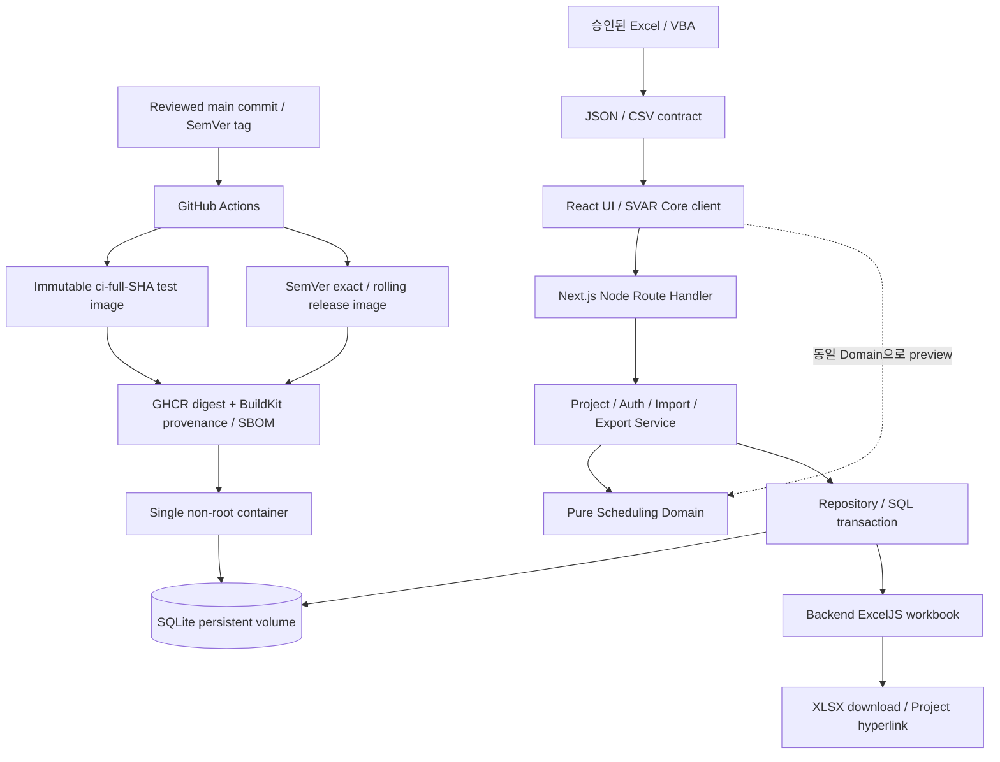

# Architecture draft

상태: Manager 통합 설계. W01–W07의 Project·authorization, pure Calendar/Leaf Scheduling과 root Task/Milestone persistence, W20의 CI/CD·최소 container artifact 기반 및 W21의 동기 Grid+Chart 작업공간을 구현했다. W24는 child 저장·Summary 집계와 순수 WBS 계산을 선행하지만 W08 전체 완료는 아니며, WBS DTO/UI·Reparent·FS 재계산, Import/Export와 production 배포 승인은 후속이다. 요구사항은 [REQUIREMENTS.md](REQUIREMENTS.md), 설계 판단은 [DECISIONS.md](DECISIONS.md)에서 관리한다.

## 경계



위 Repository→Export 화살표는 snapshot DTO 전달이다. Export Service가 조회를 조정하며 Repository가 ExcelJS를 import하지 않는다. 모든 persistence 접근은 Service 아래 Repository를 통한다.

| 영역 | 책임 | 금지하는 결합 | 최초 담당 |
| --- | --- | --- | --- |
| Frontend | Project UI, browser-only SVAR, unlock, preview, validation·loading·error, server 결과 반영 | DB/native module/secret import, UI 상태로 권한 판정 | frontend |
| Route | HTTP parse·size/content-type 제한·응답 | SQL과 scheduling 알고리즘 | backend |
| Service | Project authorization, validation, revision, transaction 조정, Domain 호출 | SVAR store를 진실의 원천으로 사용 | backend |
| Repository | bound SQL, scope, FK·snapshot·atomic persistence | business scheduling, workbook 생성 | backend |
| Domain | date/calendar, graph, summary/WBS, deterministic calculation | React, SVAR, DB, network, 현재 시각의 암묵 의존 | scheduler |
| Excel/VBA | Header mapping, 필요한 셀 정규화, JSON/CSV·오류 보고 | DRM 우회, backend schema 단독 변경 | excel_vba |
| Export | DB snapshot→Project/Tasks/Dependencies XLSX, Phase 2 Gantt | PRO export, token hyperlink | backend |
| Deployment / CI | Node/native build, Actions, Semantic release, GHCR, volume·permission·health·backup | image 안의 DB/secret, PR write token, mutable image를 test 기준으로 사용, 다중 writer instance | infra |
| QA | 실제 계약과 결과의 독립 비교 | 구현 Agent 보고를 그대로 PASS 처리 | qa_docs |

## 제안 Directory 구조

아래는 목표 구조다. W01–W07에서 `app`, `components`, `features/gantt`, `features/projects`, `contracts`, `domain/scheduling`, `server/db`, `server/repositories`, `server/projects`, `server/security`, `db/migrations`, 관련 `tests` 경로를 만들었고 나머지는 담당 작업에서 추가한다.

```text
src/app/                         Next.js pages and HTTP routes
src/components/                  general UI
src/features/gantt/              SVAR client wrapper and adapters
src/features/import/             wizard, mapping, preview
src/server/projects/             implemented Project contract/service/HTTP orchestration
src/server/security/             credential/session/cookie/origin/rate primitives and route policy inventory
src/server/services/             future cross-feature service orchestration
src/server/repositories/         SQL access
src/server/db/                   connection and migration runner
src/domain/scheduling/           pure domain and fixtures
src/contracts/                   validated API/import DTOs, no server imports
db/migrations/                  ordered SQL, no actual database
excel/vba/                      future approved VBA POC and exporter
tests/                          integration / browser / deployment evidence
.github/workflows/              PR/main CI and SemVer-tagged GHCR release
scripts/                        migration, version validation, container smoke helpers
docs/                           sources of truth and execution plan
```

`server-only` 경계와 dependency rules로 DB·crypto/session 모듈이 client bundle에 유입되지 않게 한다. Native driver를 쓰는 route는 Node runtime이다. Edge runtime과 serverless ephemeral filesystem은 초기 배포 대상이 아니다.

## Frontend와 SVAR

현재 UX 우선 계약은 [PROJECT_UX.md](PROJECT_UX.md)다. PR #23에서 첫 child 전환 팝업을 생략하고 설정을 헤더 버튼의 별도 모달로 변경했다. 서버의 `convertParentToSummary: true`, session/Origin/If-Match 및 독립 집계 계약은 유지한다.

SVAR 공식 Next.js guide의 client wrapper, theme/CSS, `init` API를 따랐고 W03에서 browser-only mount와 production build를 검증했다. [공식 integration guide](https://docs.svar.dev/react/gantt/integration-guides/nextjs/setup/), [W03 검증](W03_REVIEW.md)

Project Direct GET snapshot은 Cookie가 있어도 항상 Readonly다. UI는 별도 current-session GET으로 edit 표시를 동기화하고 password unlock 뒤 metadata/password/logout control을 활성화한다. 서버는 UI 상태와 무관하게 매 mutation에서 Project-bound session을 다시 확인한다.

UI는 공식 task/link/hierarchy editor를 우선 사용한다. Adapter가 external ID↔SVAR ID, date-only↔Date, end 포함↔SVAR endpoint 의미, working-day duration↔calendar span, domain link type↔SVAR link type을 변환한다. W07은 설치된 Core 2.7.3에서 실제 이동·좌우 resize를 수행해 exclusive widget end↔inclusive domain end 변환과 서버 저장 왕복을 확인했다. 최종 콜백의 전체 Task 상태는 기존 endpoint와 비교해 move/start-resize/end-resize 명령으로 구분한다.

편집 명령은 Core `onUpdateTask`의 최종 이벤트만 API로 보낸다. 요청 동안 동일 aggregate 후속 변경을 동기 mutex로 막고, 성공 시 전체 canonical snapshot으로 교체한다. 실패·412·응답 불확실성에는 서버를 재조회하며, 재조회도 실패하면 React에 남은 마지막 확정 Snapshot으로 SVAR를 강제 재마운트한다. PRO auto-scheduler를 실행하지 않는다. 공식 Data Provider는 본 프로젝트의 cookie/If-Match/canonical full snapshot 계약과 맞지 않아 W07에서 직접 채택하지 않았다.

Issue #3에서는 React canonical snapshot 교체와 SVAR 재마운트를 분리한다. 정상 저장은 동일 인스턴스에서 공개 serialize/exec 기반 차이 반영을 사용하며 요청 중 잠금은 권한/readonly와 분리한다. 기존 scroll·선택·접힘을 우선 보존하고 임의 신규 행 이동을 하지 않는다. 내부 반영은 사용자 command로 재전송하지 않는다. 상세 정책과 실제 검증 상태는 [Issue #3 기록](ISSUE_3_REVIEW.md)을 따른다. 현재 Grid Header `+`와 행 `+`는 입력창 없이 `새 작업`, 브라우저 local 오늘, 기간 1일을 적용한다. 첫 child의 일반 Task→Summary 전환도 별도 확인창 없이 아래의 명시적 서버 옵션으로 원자 처리한다.

Project route는 Demo navigation 없이 하나의 SVAR Gantt 인스턴스를 `displayMode="all"`로 실행한다. 같은 Task tree를 Grid와 Chart가 공유하며 Core의 세로 동기화와 Resizer를 사용한다. W24는 native `add-task` column을 표시하되 `api.intercept`로 로컬 임의 생성을 차단한다. Header `+`는 root를, 행 `+`는 child를 즉시 요청하고 edit session·If-Match·서버 계산을 거쳐 canonical snapshot만 반영한다. 첫 child 생성의 일반 Task→Summary는 UI 확인창을 사용하지 않고 `convertParentToSummary: true`를 명시하며, 서버가 parent 전환/child 생성/ancestor 저장/revision 증가를 한 transaction에서 검증·처리한다. Milestone parent와 유효하지 않은 전환은 계속 거부한다. Summary min/max·근무일 span·하위 Leaf 가중진척은 독립 `recalculateHierarchy`에서 계산한다. Summary는 이름만 API로 변경할 수 있고 계산 일정의 직접 편집·삭제는 허용하지 않는다. WBS는 이 순수 계산 결과에 포함되지만 아직 HTTP DTO나 Grid에 노출하지 않는다. Reparent와 FS 계산·저장은 별도 범위다.

Project 작업공간은 viewport 기반 flex/min-height 경계 안에서 Project header와 설정 control을 유지하고 SVAR 내부를 세로 스크롤한다. Grid/Chart header는 Core sticky 동작을 사용한다. Project 정보·비밀번호 변경·편집 종료 설정은 header의 `프로젝트 설정` 버튼으로 여는 별도 modal에 두며, 프로젝트명 아래의 과거 기본 접힘 패널은 표시하지 않는다. 설정 modal을 열고 닫아도 Gantt를 재마운트하지 않는다. 좁은 화면에서도 Grid와 Chart를 함께 유지하는 내부 가로 scroll을 제공하고, 외부 ID 표시 상태는 revision remount 밖에 보관한다. Chart 주말은 `highlightTime`을 사용하고 Grid/scale/List 날짜는 사용자 locale로 표시한다. Date-only는 원래 달력 날짜를 유지하며 instant timestamp만 브라우저 시간대로 표시한다.

화면: Project List/Create, Direct Gantt, Edit Unlock, Import Wizard, Export. UI toolkit은 shadcn/ui와 Tailwind 후보이며 설치 시 license·version을 확인한다. 핵심 Gantt 기능은 Core를 사용한다. Project List는 D02 승인에 따라 앱 접속자 전체에게 공개 summary만 제공한다. 빈 목록과 DB 오류는 구분하며 생성 후 복귀 및 reload 시 최신 목록을 조회한다.

Project 경로는 `Route Handler → ProjectService → ProjectRepository/EditSessionRepository/ScheduleRepository → SQLite`를 따른다. Route가 canonical `APP_BASE_URL`과 unsafe method의 exact `Origin`, UTF-8 JSON content type, 32 KiB body, strict Zod input을 검사한다. Service는 비동기 scrypt를 transaction 밖에서 수행한다. Task mutation은 짧은 `BEGIN IMMEDIATE` transaction 안에서 session을 다시 검증하고 revision을 비교한 뒤 Leaf는 W06 `scheduleLeaf`, W24 child/ancestor 변경은 `recalculateHierarchy`를 호출해 저장하며 revision을 정확히 한 번 증가시킨다. Direct read와 mutation success는 canonical DTO를 반환한다. Collection GET은 D02 승인으로 no-store 공개 summary 목록을 반환하며 credential/session을 조회하거나 편집 권한을 부여하지 않는다.

## 쓰기와 동시성

1. Route가 Origin/content type/입력 크기를 검사하고 Project public ID를 해석한다.
2. Service가 해당 Project의 session 유효성을 검증한다.
3. 입력 계약과 현재 aggregate snapshot을 검증하고 scheduling candidate를 계산한다.
4. 짧은 write transaction 안에서 session/revision을 최종 확인하고 필요 시 동일 snapshot을 사용해 계산한다. 계산과 저장 사이 revision이 달라지면 재시도·덮어쓰기 대신 412를 반환한다.
5. Project/tasks/links/summary 결과를 함께 저장하고 revision을 한 번 증가시킨다.
6. canonical snapshot과 ETag를 반환한다. 실패 시 전체 상태는 이전과 같다.

Empty summary가 금지되므로 새 summary와 자식 생성·재배치 같은 hierarchy 변경은 [API](API.md)의 atomic batch 계약으로 한 번에 제출한다. 숨은 cascade 삭제를 하지 않는다. Schema는 [DB_SCHEMA.md](DB_SCHEMA.md) 참조.

## Scheduling

Input에는 사용자 요청 `requestedStart`와 duration, mode, parent/order, calendar, FS edges가 있다. Output에는 effective start/end, summary, WBS, 변경 이유·오류가 있다. W06은 자체 Gregorian ordinal 기반 date-only·Calendar·Leaf/Milestone 계산을 먼저 구현했으며 system timezone과 `Date` instant API에 의존하지 않는다. W24는 Parent graph를 검증하고 child Leaf에서 Summary와 WBS를 계산하지만 WBS를 저장·전송·표시하지 않으며 Reparent와 FS 계산도 수행하지 않는다. Service가 요청값과 계산값을 분리 저장하므로 향후 dependency 제거·앞당김 시 원래 요청일로 복귀할 수 있다. Server의 계산이 권위이며 browser preview는 같은 pure code를 사용해도 저장 권한은 없다. 상세 규칙은 [SCHEDULING_ENGINE.md](SCHEDULING_ENGINE.md)만이 정의한다.

## Import / Export

Excel→VBA→JSON/CSV는 [VBA_EXPORT.md](VBA_EXPORT.md)의 승인된 환경 POC를 선행한다. [IMPORT_SCHEMA.md](IMPORT_SCHEMA.md)는 producer/consumer 공동 검토 후 Manager가 승인한다. 파일의 Project metadata가 URL의 기존 Project를 바꾸거나 session을 제공할 수 없다.

서버 preview는 정규화와 모든 graph/calendar validation을 수행한다. Commit은 원본 정규화 payload를 다시 검증하고 `If-Match`를 확인한 후 원자적으로 저장한다. 초기 create-only batch는 업데이트·삭제·replace를 수행하지 않는다. Fixture 파일을 이용한 웹 parser 개발과 실제 조직 Excel POC의 통과 상태를 구분한다.

Web export는 일정 DTO의 DB 일관된 snapshot을 얻고 transaction 밖에서 ExcelJS로 생성한다. Phase 1은 표 workbook과 canonical hyperlink, Phase 2는 기간 제한이 있는 날짜 cell Gantt다. [IMPORT_EXPORT.md](IMPORT_EXPORT.md) 참조.

## Security와 운영

W04 생성 bootstrap에 이어 W05는 recorded scrypt profile의 timing-safe password 검증, unknown/corrupt credential dummy KDF, Project-bound session의 expiry/revoke/auth-version 검증, logout, password rotation과 metadata mutation authorization을 적용한다. Cookie는 8시간 HttpOnly/SameSite=Strict이며 production에서 Secure/`__Host-`를 강제한다. Unlock은 bounded process-local global+Project limiter와 공유 KDF concurrency 2 상한을 사용한다. [SECURITY.md](SECURITY.md)가 세부 정책이다. Public URL은 편집 권한을 부여하지 않지만 읽기 기밀성을 보장하는 인증도 아니다. production 노출 범위는 사용자 결정 항목이다.

초기 운영은 한 Node application container와 local persistent SQLite volume이다. Native addon은 빌드·런타임 ABI/libc/architecture를 일치시키고 non-root permission과 restart persistence를 검사한다. PR과 수동 CI는 read-only로 application/browser/container 회귀만 수행한다. 모든 gate를 통과한 `main` push는 임시 `ci-<full SHA>` image를 게시해 registry exact digest runtime을 검증한 뒤 해당 package version을 삭제한다. Release는 `package.json`과 일치하며 이전 tag보다 큰 annotated Semantic Version만 직렬 처리하고, local candidate 검증 후 GHCR exact SemVer를 직접 게시·재검증한 뒤 stable rolling alias만 같은 digest로 승격한다. Release commit 고정 `sha-*` candidate는 보관하지 않는다. Consumer와 post-publish smoke는 mutable alias가 아니라 exact version/digest를 사용한다. WAL-aware backup과 production host restore는 별도 경로에서 시험한다. [CI_CD.md](CI_CD.md), [DEPLOYMENT.md](DEPLOYMENT.md) 참조.

## 구현 진입 Gate

최초 vertical slice인 Project 생성→SQLite 저장→Direct Readonly→unlock→root Task 생성·SVAR 이동/resize→reload 유지→삭제를 W07에서 독립 QA PASS / Manager ACCEPT했다. W20 Semantic Release, W21 동기 Grid+Chart와 W22 main commit image 자동화도 완료했다. Main/PR/release workflow, private GHCR publish, commit/release digest의 원격·로컬 smoke와 SBOM/provenance 조회를 PASS했다. D05에 따라 현재 private 요금제의 ruleset 미강제 위험을 수용하고 GitHub Artifact Attestation은 비활성으로 둔다. W23은 D02 승인으로 목록을 활성화했다. W24가 W08의 child 생성·Summary 집계·순수 WBS 계산 일부를 선행하며, WBS DTO/UI·Reparent·FS와 유효 subtree 변경 묶음은 후속이다. VBA는 D01, 운영 공개는 D03 및 별도 네트워크/TLS 배포 검증을 따른다. 전체 기능을 한 번에 시작하지 않는다.
