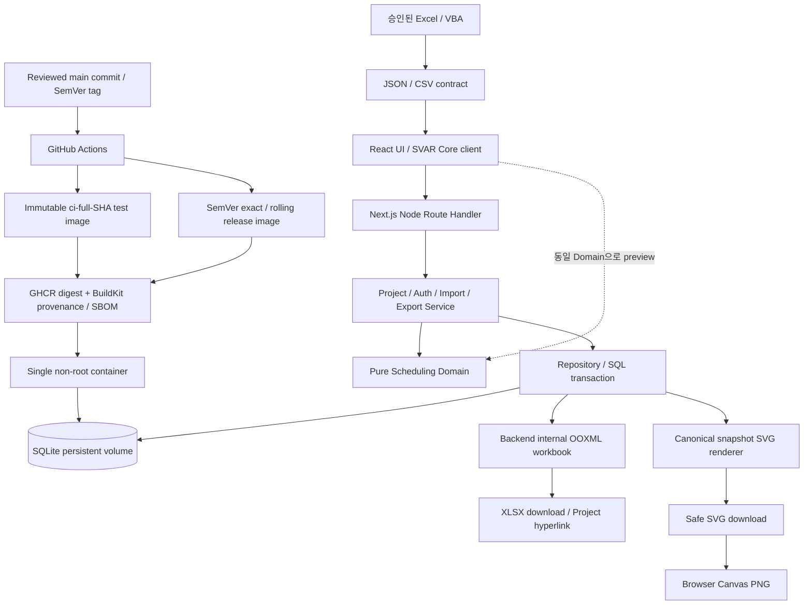

# Architecture draft

## Issue #459 — Stage Gate 통합 데이터 흐름

Stage Gate는 별도 Gantt 엔진이나 UI별 계산기가 아니라 하나의 canonical Project snapshot에서 파생되는 공통 도메인 projection이다.

```text
SQLite explicit membership + canonical Task/Link/WBS
  → projectStageGates / milestone-stage-core
  → canonical Project Task.membership + Milestone.stageGate
  → Task Editor / Gantt Grid·filter / Milestone Dashboard
  → Logistics·Resource drill-down / JSON·Excel projection
```

- 저장 authority는 explicit Task/Summary→Milestone row이며 effective membership과 Ready는 full hierarchy/Link snapshot에서 계산한다.
- Task→Task 실행 Dependency와 Milestone→Milestone Gate Dependency는 같은 Link 저장소를 사용하더라도 의미를 섞지 않는다. member Task들의 Dependency를 단계 edge로 자동 투영하지 않는다.
- UI scope/filter/접힘/현재 Dashboard 조건은 Stage 계산 authority가 아니다. 화면은 서버 canonical projection 또는 동일 pure domain preview를 소비한다.
- Dashboard와 Export는 Ready/진척을 독자 계산하지 않고 같은 typed projection을 사용한다. 부분 물류·Resource 조건은 단계 선택/공수 범위를 제한할 수 있지만 full-stage Ready를 재정의하지 않는다.
- Import/Copy/Template는 explicit row identity를 remap·보존하고 파생 projection을 입력 authority로 저장하지 않는다.

#460~#464가 이 경계를 각각 저장/Editor/Gantt/KPI/교환 경로에 구현한다. 세부 계약은 [Milestone Stage Gates](MILESTONE_STAGE_GATES.md)를 따른다.

## Issue #460 — 공유 Stage Gate 경계

`src/domain/milestones/stage-gates.ts`는 SVAR/SQLite와 독립된 전체 hierarchy 상속·Ready·완료 진단·구조 잠금 계산이다. 브라우저 DTO adapter/draft preview도 같은 pure 함수를 사용한다. `MilestoneMembershipRepository`는 explicit row만 저장하고 `milestone-stage-core.ts`가 DB snapshot/projector/보존 guard를 공유한다. Route → Service → Repository → SQLite 경계와 IMMEDIATE transaction/session/revision을 유지한다. 각 Task/Link/hierarchy/subtree/metadata canonical 응답에 같은 projection을 반영하며 Calendar/Assignment/Logistics 전용 응답은 기존 갱신 계약을 유지한다. 신규 UI나 별도 Gantt 엔진은 도입하지 않는다. [상세 저장·경로 inventory](MILESTONE_STAGE_GATES.md)를 따른다.


## Issue #464 — 보존과 JSON 교환 서비스

`ProjectImportService`는 기존 Repository/Task DTO/Calendar/Scheduling/Stage guard를 조합하여 create-only preview/commit을 제공한다. HTTP handler가 Origin/session/strong revision과 bounded file parser를 연결하고 wrapper는 기존 DB/Project authorization을 재사용한다. Parser는 fatal UTF-8/한 BOM/duplicate key/JSON syntax depth64를 JSON.parse 이전에 확인한다. `validateProjectImportPayload`는1.0 pure validator를 그대로 dispatch하고1.1 authored leaf/Summary/membership을 검증한다. source UUID/Calendar는 참고이며 target Calendar와 새 UUID가 authority다. preview read transaction과 commit IMMEDIATE transaction에서 권한/revision/collision/budget/전체 E/P 완료 guard를 재검증한다. digest는 상태 없는 file+target+baseRevision binding이며 preview 저장소나 새로운 권한 모델은 없다. canonical201 응답은 기존 ProjectSnapshotResponse/permission edit를 사용한다.

`ProjectJsonExportService`는 같은 DB read transaction과 clock1회에서 전체 canonical snapshot을1.1 authored 파일로 변환한다. 기존 mixed Dependency도 원형 유지하고 imports는 신규 mixed 정책으로 전체 거부한다. JSON은 source UUID/metadata만 전달하고 Resource/물류/Password/session·새 Direct Hyperlink를 추가하지 않는다. `ProjectExportSnapshotService`는 Excel 전용 canonical/defaultStage/optionalResource bundle을 같은 read transaction에서 만들고 Project/Catalog revision을 확인한다. Stage 산식/Ready를 workbook에서 재계산하지 않으며 default 전체F는 현재 Dashboard 필터와 별개다. writer는 원시/null 수치와 행별 식별자를 OOXML inlineStr/안전 숫자로 출력하고 한도 초과는 전체 실패다.

Copy/Template은 explicit FK remap과 서버 소유 전체 보존 검증을 사용한다. subtree Copy의 사용자 확인은 외부 소속·상속·destination 효과만 확인하며 Assignment/완료/권한 잠금을 우회하지 않는다. trusted historical completion baseline은 완전 보존된 서버 Copy에만 허용하고 외부 JSON import는 사용하지 않는다. 저장 schema/migration/Calendar·Dependency 알고리즘/Resource engine은 변경하지 않는다.


상태: Manager 통합 설계. W01–W07의 Project·authorization, pure Calendar/Leaf Scheduling과 root Task/Milestone persistence, W20의 CI/CD·최소 container artifact 기반 및 W21의 동기 Grid+Chart 작업공간을 구현했다. W24는 child 저장·Summary 집계와 순수 WBS 계산을 선행했고 Excel 및 Issue #245 SVG/PNG 내보내기를 추가했다. 이 상태가 Import 전체, W08 전체 또는 production 배포 승인을 뜻하지는 않는다. 요구사항은 [REQUIREMENTS.md](REQUIREMENTS.md), 설계 판단은 [DECISIONS.md](DECISIONS.md)에서 관리한다.

## 경계


```mermaid
flowchart TD
  Browser[React UI / SVAR Core client] --> API[Next.js Node Route Handler]
  API --> Service[Project / Auth / Import / Export Service]
  Service --> Domain[Pure Scheduling Domain]
  Service --> Repo[Repository / SQL transaction]
  Repo --> DB[(SQLite persistent volume)]
  Git[Reviewed main commit / SemVer tag] --> Actions[GitHub Actions]
  Actions --> CommitImage[Immutable ci-full-SHA test image]
  Actions --> ReleaseImage[SemVer exact / rolling release image]
  CommitImage --> GHCR[GHCR digest + BuildKit provenance / SBOM]
  ReleaseImage --> GHCR
  GHCR --> Runtime[Single non-root container]
  Runtime --> DB
  Browser -. 동일 Domain으로 preview .-> Domain
  Excel[승인된 Excel / VBA] --> File[JSON / CSV contract]
  File --> Browser
  Repo --> Export[Backend internal OOXML workbook]
  Export --> XLSX[XLSX download / Project hyperlink]
  Repo --> SvgExport[Canonical snapshot SVG renderer]
  SvgExport --> SVG[Safe SVG download]
  SVG --> PNG[Browser Canvas PNG]
```

위 Repository→Export 화살표는 snapshot DTO 전달이다. Export Service가 조회를 조정하며 Repository가 OOXML/SVG writer를 import하지 않는다. 모든 persistence 접근은 Service 아래 Repository를 통한다.

| 영역 | 책임 | 금지하는 결합 | 최초 담당 |
| --- | --- | --- | --- |
| Frontend | Project UI, browser-only SVAR, unlock, preview, validation·loading·error, server 결과 반영 | DB/native module/secret import, UI 상태로 권한 판정 | frontend |
| Route | HTTP parse·size/content-type 제한·응답 | SQL과 scheduling 알고리즘 | backend |
| Service | Project authorization, validation, revision, transaction 조정, Domain 호출 | SVAR store를 진실의 원천으로 사용 | backend |
| Repository | bound SQL, scope, FK·snapshot·atomic persistence | business scheduling, workbook 생성 | backend |
| Domain | date/calendar, graph, summary/WBS, deterministic calculation | React, SVAR, DB, network, 현재 시각의 암묵 의존 | scheduler |
| Excel/VBA | Header mapping, 필요한 셀 정규화, JSON/CSV·오류 보고 | DRM 우회, backend schema 단독 변경 | excel_vba |
| Export | DB snapshot→XLSX 또는 결정적 SVG; 브라우저에서 SVG→PNG | PRO export, token hyperlink, 외부 변환 서비스 | backend + frontend |
| Deployment / CI | Node/native build, Actions, Semantic release, GHCR, volume·permission·health·backup | image 안의 DB/secret, PR write token, mutable image를 test 기준으로 사용, 다중 writer instance | infra |
| QA | 실제 계약과 결과의 독립 비교 | 구현 Agent 보고를 그대로 PASS 처리 | qa_docs |

## 제안 Directory 구조

아래는 목표 구조다. W01–W07에서 `app`, `components`, `features/gantt`, `features/projects`, `contracts`, `domain/scheduling`, `server/db`, `server/repositories`, `server/projects`, `server/security`, `db/migrations`, 관련 `tests` 경로를 만들었고 나머지는 담당 작업에서 추가한다.

```text
src/app/                         Next.js pages and HTTP routes
src/components/                  general UI
src/features/gantt/              SVAR client wrapper and adapters
src/features/import/             wizard, mapping, preview
src/server/projects/             implemented Project contract/service/HTTP orchestration
src/server/security/             credential/session/cookie/origin/rate primitives and route policy inventory
src/server/services/             future cross-feature service orchestration
src/server/repositories/         SQL access
src/server/db/                   connection and migration runner
src/domain/scheduling/           pure domain and fixtures
src/contracts/                   validated API/import DTOs, no server imports
db/migrations/                  ordered SQL, no actual database
excel/vba/                      future approved VBA POC and exporter
tests/                          integration / browser / deployment evidence
.github/workflows/              PR/main CI and SemVer-tagged GHCR release
scripts/                        migration, version validation, container smoke helpers
docs/                           sources of truth and execution plan
```

`server-only` 경계와 dependency rules로 DB·crypto/session 모듈이 client bundle에 유입되지 않게 한다. Native driver를 쓰는 route는 Node runtime이다. Edge runtime과 serverless ephemeral filesystem은 초기 배포 대상이 아니다.

## Frontend와 SVAR

현재 UX 우선 계약은 [PROJECT_UX.md](PROJECT_UX.md)다. PR #23에서 첫 child 전환 팝업을 생략하고 설정을 헤더 버튼의 별도 모달로 변경했다. 서버의 `convertParentToSummary: true`, session/Origin/If-Match 및 독립 집계 계약은 유지한다.

SVAR 공식 Next.js guide의 client wrapper, theme/CSS, `init` API를 따랐고 W03에서 browser-only mount와 production build를 검증했다. [공식 integration guide](https://docs.svar.dev/react/gantt/integration-guides/nextjs/setup/), [W03 검증](W03_REVIEW.md)

Project Direct GET snapshot은 Cookie가 있어도 항상 Readonly다. UI는 별도 current-session GET으로 edit 표시를 동기화하고 password unlock 뒤 metadata/password/logout control을 활성화한다. 서버는 UI 상태와 무관하게 매 mutation에서 Project-bound session을 다시 확인한다.

UI는 공식 task/link/hierarchy editor를 우선 사용한다. Adapter가 external ID↔SVAR ID, date-only↔Date, end 포함↔SVAR endpoint 의미, working-day duration↔calendar span, domain link type↔SVAR link type을 변환한다. W07은 설치된 Core 2.7.3에서 실제 이동·좌우 resize를 수행해 exclusive widget end↔inclusive domain end 변환과 서버 저장 왕복을 확인했다. 최종 콜백의 전체 Task 상태는 기존 endpoint와 비교해 move/start-resize/end-resize 명령으로 구분한다.

편집 명령은 Core `onUpdateTask`의 최종 이벤트만 API로 보낸다. 요청 동안 동일 aggregate 후속 변경을 동기 mutex로 막고, 성공 시 전체 canonical snapshot으로 교체한다. 실패·412·응답 불확실성에는 `no-store`로 서버를 재조회하며 Project identity와 revision을 검증한다. 재조회 실패나 오래된 응답은 마지막 서버 확정 snapshot을 동일 SVAR 인스턴스의 공개 serialize/exec 동기화 경로로 다시 적용한다(#344). 요청의 실패로 이전 성공 변경을 되돌리거나 widget을 재마운트하지 않는다. 공개 SVAR 동기화 자체가 예외를 낸 경우의 최후 reset fallback은 별도 경로로 유지한다. PRO auto-scheduler를 실행하지 않는다. 공식 Data Provider는 본 프로젝트의 cookie/If-Match/canonical full snapshot 계약과 맞지 않아 W07에서 직접 채택하지 않았다.

Issue #3에서는 React canonical snapshot 교체와 SVAR 재마운트를 분리한다. 정상 저장은 동일 인스턴스에서 공개 serialize/exec 기반 차이 반영을 사용하며 요청 중 잠금은 권한/readonly와 분리한다. 기존 scroll·선택·접힘을 우선 보존하고 임의 신규 행 이동을 하지 않는다. 내부 반영은 사용자 command로 재전송하지 않는다. 상세 정책과 실제 검증 상태는 [Issue #3 기록](ISSUE_3_REVIEW.md)을 따른다. 현재 Grid Header `+`와 행 `+`는 입력창 없이 `새 작업`, 브라우저 local 오늘, 기간 1일을 적용한다. 첫 child의 일반 Task→Summary 전환도 별도 확인창 없이 아래의 명시적 서버 옵션으로 원자 처리한다.

Project route는 Demo navigation 없이 하나의 SVAR Gantt 인스턴스를 `displayMode="all"`로 실행한다. 같은 Task tree를 Grid와 Chart가 공유하며 Core의 세로 동기화와 Resizer를 사용한다. W24는 native `add-task` column을 표시하되 `api.intercept`로 로컬 임의 생성을 차단한다. 전체 Project의 Header `+`는 root를, 행 `+`는 child를 즉시 요청한다. #418의 scoped Workspace에서는 같은 Header `+`를 active Summary root의 immediate child로 정규화하고 Row `+`는 해당 row child로 정규화한다. UI enabled/disabled와 실제 target은 하나의 resolver를 공유하며 edit session·If-Match·서버 계산을 거쳐 canonical snapshot만 반영한다. canonical Core sync와 `filter-tasks`도 같은 직렬 queue에서 처리해 scope frame의 중간 empty 상태를 노출하지 않는다. 첫 child 생성의 일반 Task→Summary는 UI 확인창을 사용하지 않고 `convertParentToSummary: true`를 명시하며, 서버가 parent 전환/child 생성/ancestor 저장/revision 증가를 한 transaction에서 검증·처리한다. Milestone parent와 유효하지 않은 전환은 계속 거부한다. Summary min/max·근무일 span·하위 Leaf 가중진척은 독립 `recalculateHierarchy`에서 계산한다. Summary의 계산 일정은 직접 편집하지 않으며 기존 이름/설명/URL 필드 정책을 따른다. 자식 없는 Summary 자체는 단건 삭제할 수 있고 자손이 있으면 명시적 subtree 삭제를 사용한다. WBS는 이 순수 계산 결과에 포함되지만 아직 HTTP DTO나 Grid에 노출하지 않는다. Reparent와 FS 계산·저장은 별도 범위다.

Project 작업공간은 viewport 기반 flex/min-height 경계 안에서 Project header와 설정 control을 유지하고 SVAR 내부를 세로 스크롤한다. Grid/Chart header는 Core sticky 동작을 사용한다. Project 정보·비밀번호 변경·편집 종료 설정은 header의 `프로젝트 설정` 버튼으로 여는 별도 modal에 두며, 프로젝트명 아래의 과거 기본 접힘 패널은 표시하지 않는다. 설정 modal을 열고 닫아도 Gantt를 재마운트하지 않는다. 좁은 화면에서도 Grid와 Chart를 함께 유지하는 내부 가로 scroll을 제공하고, 외부 ID 표시 상태는 revision remount 밖에 보관한다. Chart 주말은 `highlightTime`을 사용하고 Grid/scale/List 날짜는 사용자 locale로 표시한다. Date-only는 원래 달력 날짜를 유지하며 instant timestamp만 브라우저 시간대로 표시한다.

화면: Project List/Create, Direct Gantt, Edit Unlock, Import Wizard, Export. UI toolkit은 shadcn/ui와 Tailwind 후보이며 설치 시 license·version을 확인한다. 핵심 Gantt 기능은 Core를 사용한다. Project List는 D02 승인에 따라 앱 접속자 전체에게 공개 summary만 제공한다. 빈 목록과 DB 오류는 구분하며 생성 후 복귀 및 reload 시 최신 목록을 조회한다.

Project 경로는 `Route Handler → ProjectService → ProjectRepository/EditSessionRepository/ScheduleRepository → SQLite`를 따른다. Route가 canonical `APP_BASE_URL`과 unsafe method의 exact `Origin`, UTF-8 JSON content type, 32 KiB body, strict Zod input을 검사한다. Service는 비동기 scrypt를 transaction 밖에서 수행한다. Task mutation은 짧은 `BEGIN IMMEDIATE` transaction 안에서 session을 다시 검증하고 revision을 비교한 뒤 Leaf는 W06 `scheduleLeaf`, W24 child/ancestor 변경은 `recalculateHierarchy`를 호출해 저장하며 revision을 정확히 한 번 증가시킨다. Direct read와 mutation success는 canonical DTO를 반환한다. Collection GET은 D02 승인으로 no-store 공개 summary 목록을 반환하며 credential/session을 조회하거나 편집 권한을 부여하지 않는다.

## 쓰기와 동시성

1. Route가 Origin/content type/입력 크기를 검사하고 Project public ID를 해석한다.
2. Service가 해당 Project의 session 유효성을 검증한다.
3. 입력 계약과 현재 aggregate snapshot을 검증하고 scheduling candidate를 계산한다.
4. 짧은 write transaction 안에서 session/revision을 최종 확인하고 필요 시 동일 snapshot을 사용해 계산한다. 계산과 저장 사이 revision이 달라지면 재시도·덮어쓰기 대신 412를 반환한다.
5. Project/tasks/links/summary 결과를 함께 저장하고 revision을 한 번 증가시킨다.
6. canonical snapshot과 ETag를 반환한다. 실패 시 전체 상태는 이전과 같다.

빈 Summary를 직접 생성할 수 있고 자식 생성·재배치 같은 hierarchy 변경은 [API](API.md)의 원자적 mutation 계약으로 제출한다. 숨은 cascade 삭제를 하지 않는다. Schema는 [DB_SCHEMA.md](DB_SCHEMA.md) 참조.

## Scheduling

Input에는 사용자 요청 `requestedStart`와 duration, mode, parent/order, calendar, FS/SS/FF/SF 및 signed lag 관계가 있다. Output에는 effective start/end, summary, WBS, 변경 이유·오류가 있다. W06은 자체 Gregorian ordinal 기반 date-only·Calendar·Leaf/Milestone 계산을 먼저 구현했으며 system timezone과 `Date` instant API에 의존하지 않는다. W24 당시에는 Parent graph를 검증하고 child Leaf에서 Summary와 WBS를 계산했으나 WBS를 저장·전송·표시하지 않았고 Reparent와 FS 계산도 후속 범위였다. 현재 관계 계산은 generic dependency engine을 사용하며, Service가 요청값과 계산값을 분리 저장하므로 dependency 제거·앞당김 시 원래 요청일로 복귀할 수 있다. Server의 계산이 권위이며 browser preview는 같은 pure code를 사용해도 저장 권한은 없다. 상세 규칙은 [SCHEDULING_ENGINE.md](SCHEDULING_ENGINE.md)만이 정의한다.

## Import / Export

Excel→VBA→JSON/CSV는 [VBA_EXPORT.md](VBA_EXPORT.md)의 승인된 환경 POC를 선행한다. [IMPORT_SCHEMA.md](IMPORT_SCHEMA.md)는 producer/consumer 공동 검토 후 Manager가 승인한다. 파일의 Project metadata가 URL의 기존 Project를 바꾸거나 session을 제공할 수 없다.

서버 preview는 정규화와 모든 graph/calendar validation을 수행한다. Commit은 원본 정규화 payload를 다시 검증하고 `If-Match`를 확인한 후 원자적으로 저장한다. 초기 create-only batch는 업데이트·삭제·replace를 수행하지 않는다. Fixture 파일을 이용한 웹 parser 개발과 실제 조직 Excel POC의 통과 상태를 구분한다.

Web export는 일정 DTO의 DB 일관된 snapshot을 얻고 transaction 밖에서 내부 OOXML/ZIP writer로 Excel workbook을, 자체 renderer로 안전한 SVG를 생성한다. PNG는 브라우저 Canvas가 같은 SVG를 변환한다. 현재 Excel 계약은 [EXCEL_EXPORT.md](EXCEL_EXPORT.md), 이미지 계약은 [IMAGE_EXPORT.md](IMAGE_EXPORT.md)를 따른다. [IMPORT_EXPORT.md](IMPORT_EXPORT.md)의 초기 단계 계획과 충돌하면 현재 구현 계약이 우선한다.

## Security와 운영

W04 생성 bootstrap에 이어 W05는 recorded scrypt profile의 timing-safe password 검증, unknown/corrupt credential dummy KDF, Project-bound session의 expiry/revoke/auth-version 검증, logout, password rotation과 metadata mutation authorization을 적용한다. Cookie는 8시간 HttpOnly/SameSite=Strict이며 production에서 Secure/`__Host-`를 강제한다. Unlock은 bounded process-local global+Project limiter와 공유 KDF concurrency 2 상한을 사용한다. [SECURITY.md](SECURITY.md)가 세부 정책이다. Public URL은 편집 권한을 부여하지 않지만 읽기 기밀성을 보장하는 인증도 아니다. production 노출 범위는 사용자 결정 항목이다.

초기 운영은 한 Node application container와 local persistent SQLite volume이다. Native addon은 빌드·런타임 ABI/libc/architecture를 일치시키고 non-root permission과 restart persistence를 검사한다. PR과 수동 CI는 read-only로 application/browser/container 회귀만 수행한다. 모든 gate를 통과한 비문서 `main` push는 `ci-<full SHA>` image를 게시해 registry exact digest runtime을 검증한다. version이 유지된 merge는 해당 package version을 정리하지만 version-changing merge의 verified candidate는 formal release까지 보존한다. Release는 `package.json`과 일치하며 이전 tag보다 큰 annotated Semantic Version만 직렬 처리하고, tag target SHA의 Main candidate source/revision/version/digest와 runtime을 재검증한 뒤 **새 build 없이 동일 digest를 exact SemVer와 stable rolling alias로 promotion**한다. Consumer와 post-publish smoke는 mutable alias가 아니라 exact version/digest를 사용한다. WAL-aware backup과 production host restore는 별도 경로에서 시험한다. [CI_CD.md](CI_CD.md), [DEPLOYMENT.md](DEPLOYMENT.md) 참조.

## 구현 진입 Gate

최초 vertical slice인 Project 생성→SQLite 저장→Direct Readonly→unlock→root Task 생성·SVAR 이동/resize→reload 유지→삭제를 W07에서 독립 QA PASS / Manager ACCEPT했다. W20 Semantic Release, W21 동기 Grid+Chart와 W22 main commit image 자동화도 완료했다. Main/PR/release workflow, private GHCR publish, commit/release digest의 원격·로컬 smoke와 SBOM/provenance 조회를 PASS했다. D05에 따라 현재 private 요금제의 ruleset 미강제 위험을 수용하고 GitHub Artifact Attestation은 비활성으로 둔다. W23은 D02 승인으로 목록을 활성화했다. W24가 W08의 child 생성·Summary 집계·순수 WBS 계산 일부를 선행하며, WBS DTO/UI·Reparent·FS와 유효 subtree 변경 묶음은 후속이다. VBA는 D01, 운영 공개는 D03 및 별도 네트워크/TLS 배포 검증을 따른다. 전체 기능을 한 번에 시작하지 않는다.

## Project Workspace UI 계층 (Issue #76)

Frontend shell은 **Global App Shell → Entity Context → Workspace View** 3단 계층을 사용한다.

- `WorkspaceShell`: viewport 기반 global header와 primary navigation을 제공하고 Project 전용 metadata/action을 소유하지 않는다.
- `ProjectReadonlyView`: compact Project context, permission status, Project Info/Settings/Unlock command와 `일정 / 리소스` peer view를 조정한다.
- `ProjectGantt`와 `ProjectResourceWorkload`: 동일 Project context의 독립 workspace panel이다. tab 전환은 API mutation이나 route navigation이 아니며 panel mount를 유지해 Gantt lifecycle/state를 보존한다.
- Resource workload API, edit-session, If-Match/revision, canonical snapshot, Scheduling Domain 경계는 UI 재배치와 독립적으로 유지한다.

Frontend 레이아웃과 interaction 상세 기준은 [UI/UX Guidelines](UI_UX_GUIDELINES.md)를 Source of Truth로 사용한다.


### Link command vertical slice (#97)

SVAR `add-link`/`delete-link` actions are intercepted before local commit. The Project workspace calls protected Link routes; `LinkService` validates the project graph, recalculates schedules and summaries, persists Link/Task/Project revision atomically, and returns the canonical snapshot for in-place Gantt synchronization.


## Issue #84 검색 Filter 경계

Issue #83에서 도입한 Task/Resource view filter와 Project List filter는 UI와 domain predicate를 분리한다. `project-search-filter.ts`의 공통 text normalization/operator primitive를 Task와 Project adapter가 공유하고, Project 전용 날짜/owner 조건은 `project-list-filter.ts`에 둔다. Project List adapter는 `ProjectListItemDto[] + browser timezone + deletedIds + view state`를 입력으로 하는 결정적 read-only 함수이며 API/DB/Project revision에 의존하지 않는다.

처리 순서는 `public summary → deletedIds 제외 → quick search → advanced clauses → visible result`다. client-side list filtering은 서버 authorization 근거가 아니며 Project mutation/security 경계를 변경하지 않는다. Project 수가 실제 client filtering 한계를 넘는 근거가 생기기 전에는 server-side search/pagination을 도입하지 않는다.


### Project status client mutation 경계 (#177)

Project-level status 변경은 새 서버 endpoint나 DB 계층을 만들지 않고 기존 metadata PATCH를 재사용한다. `src/features/projects/project-status-mutation.ts`가 List와 Workspace의 공통 client transport 경계를 담당하여 최신 status/revision 조회, current edit-session 확인, unlock 호출, status-only PATCH 및 canonical metadata mutation 판별을 한 곳에 둔다. 인증 dialog와 UI state ownership은 각 화면에 남겨 List의 password-on-demand 흐름과 Workspace의 기존 edit mode를 억지로 합치지 않는다. 412 복구는 canonical snapshot을 다시 적용하고 Gantt reset generation을 변경하지 않아 Project metadata 변경과 SVAR instance lifecycle을 분리한다.


## Issue #258 — Task 필드 PATCH와 일정 후보 경계

`src/domain/tasks/task-patch-fields.ts`의 pure `classifyTaskPatch`가 Client와 Service의 일정/비일정 필드 분류를 공유한다. 권한과 strict 입력 검증은 기존 Route/Service가 수행하며 분류 결과 자체는 권한이 아니다.

`ProjectService.updateTask`는 현재 aggregate 유효성을 확인한 뒤 field-only 요청에서는 저장된 effective start/end/requestedStart를 쓰고 Summary 진척/Baseline을 파생한다. 일정 요청에서는 직접 Task의 Calendar 계산과 end assertion을 먼저 검증하고 `src/domain/scheduling/task-candidate.ts`의 `recalculateTaskCandidate`에 전체 Project Task/Link를 넘긴다. 후보는 leaf requestedStart 재생성 → 기존 generic dependency forward-pass → Summary 계산 순서로 만든다. Service는 원본↔최종 날짜 diff로 모든 영향 leaf의 할당 범위를 한 번 읽어 검증한 뒤 후보 leaf/직접 편집/Baseline/Summary와 revision을 같은 IMMEDIATE transaction에 저장한다. `ScheduleRepository.updateLeafSchedules`는 prepared UPDATE를 재사용하고 후행별 SELECT 재조회를 하지 않는다.

Manual/resource conflict는 Task 전용 오류로 Handler에서 HTTP 409로 매핑한다. `ProjectService`의 Summary PATCH allowlist는 name/description/url/explicitMilestoneTaskId만 허용하고 파생 일정·진척·상태·Baseline은 계속 거부한다. `TaskFieldProjectService`는 같은 외부 transaction에서 Task/Summary description/url을 저장하고 canonical assignment/logistics를 enrich하므로 부분 저장이나 별도 revision 증가가 없다. Task Service에서 LinkService의 공개 mutation을 호출하지 않으며 순환 service 의존성도 추가하지 않는다. Link와 Calendar 경로는 기존 domain 공식을 계속 사용한다. 구조 명령/삭제의 linked guard는 유지한다. DB schema, migration, auth/session/Origin 계약과 CI workflow는 바뀌지 않는다.


## Issue #289 — Project master data boundary

Project classification metadata는 SVAR Task data가 아니라 application-owned global master data다. 경계는 `Project form/admin UI → project-master Route Handler → ProjectMasterService → ProjectMasterRepository → SQLite`를 따른다. Project aggregate service는 stable master public ID를 해석하고 create/update/copy/template transaction 안에서 internal FK 참조를 저장한다.

Project-master 관리자 인증은 Project edit session 및 #280 logistics catalog 관리자와 별도 권한으로 유지하되, bounded login rate-limit·scrypt/session/cookie/Origin/If-Match 보안 패턴은 기존 구현과 정합화한다. 이 메타데이터 변경은 Scheduling Domain이나 SVAR Gantt lifecycle을 변경하지 않는다.

## Issue #345: 구조와 일정 부재 경계

Summary의 WBS 구조와 자손에서 파생하는 일정은 분리한다. DTO/Repository는 미산정 Summary 일정의 null을 보존하고 SQLite migration 0018은 Summary에 한정한 all-null CHECK를 제공한다. 실제 Task/Milestone은 기존 필수 schedule로 검증한다. Domain의 hierarchy 계산이 Summary 상태와 Baseline을 파생하며 Service는 create/delete/hierarchy/calendar/link mutation을 기존 transaction/revision 경계로 저장한다.

Project/Subtree copy와 Template 인스턴스화는 null Summary 날짜를 상대 날짜 0으로 계산하지 않는다. Excel/SVG는 canonical snapshot의 모든 구조 행을 보존하고 실제 일정 집합으로 기간/bar를 계산한다. Resource workload와 물류 KPI는 Summary를 실제 Leaf의 공수·완료율 대상으로 포함하지 않는다. 부모 직접 연결과 subtree 상속은 구조를 기준으로 유지한다.

Import는 서버를 참조하지 않는 `src/contracts/import.ts`의 JSON object strict 검증 및 순수 Domain 정규화만 추가했다. schemaVersion 1.0, 기존 유효 Summary source snapshot, 생략/null 미산정 입력을 지원한다. byte/encoding/CSV parser, target DB 충돌, preview/commit API/UI/transaction Import는 별도 구현 범위이며 이 validator로 인증·persist 성공을 주장하지 않는다.


## Issue #463 — Stage Dashboard snapshot

Milestone dashboard Route → read Service → 기존 Project/Schedule/Membership/Resource Catalog/Logistics/Calendar Repository → SQLite 경계를 유지한다. Project row부터 모든 입력을 하나의 read transaction에서 조회하고 clock을 한 번 캡처한다. 새로운 DB 테이블/집계 job/cache는 없다. `milestone-dashboard-calculation-core.ts`는 전체 `projectStageGates`와 기존 Logistics pure matcher를 재사용한다. Logistics는 독립 `milestone-dashboard-projection-core.ts`만 호출하므로 두 service 사이 순환 의존성이 없다.

전체 E/P Gate와 선택 S, 공수 F는 [단계 계약](MILESTONE_STAGE_GATES.md#issue-463-단계-대시보드-읽기-모델)으로 분리한다. S 검색/선택과 WBS 화면 scope는 전체 F 합계를 축소하지 않는다. ProjectRevision은 일정/소속/관계/상태/assignment/Project Calendar/물류를, CatalogRevision은 Resource 이름·등급·그룹/calendar 선택 의존성을 반영한다. 물류 유형 code를 재해석하지 않으므로 유형 catalog revision은 계산 입력이 아니다. `md-per-mm-core.ts`는 query/ENV/null 환산을 공유하며 pure 계산 안에서 process.env를 읽지 않는다. readonly UI는 같은 snapshot의 최소 관련 catalog를 받는다. Gantt와 Dashboard peer는 같은 grid cell에 mount 상태를 유지한다. 비활성 peer는 visibility:hidden/inert/aria-hidden으로 입력과 접근성을 제외하면서 layout box를 보존한다. peer 숨김/복귀 때 기존 Gantt의 공개 scroll 상태가 손실되는 actual 회귀에 대응하여 이 배치를 적용했으며 client의 E/P/Ready/공수 계산은 추가하지 않는다.


## Issue #523 Resource KPI pure Domain

`src/domain/resources/resource-kpi.ts`는 전체 Project canonical Task/Assignment/Resource snapshot과 명시 date-only 기간·기준일·timezone, Calendar 규칙, 주입된 M/M 환경 문자열에서 결정적으로 집계한다. DB/React/SVAR/ENV/clock을 직접 읽지 않는다. `projectStageGates`, `resolveResourceCalendar`, `workingDaysBetween`을 재사용하고 A의 개인 필터와 T0 진단, full-stage 상태를 각각 typed 출력으로 분리한다. pure M/M 정책은 `domain/resources/md-per-mm.ts`로 이동하고 기존 server 경로는 re-export해 legacy caller를 보존한다. 현재 API/Repository/SQLite/권한 경계는 불변이며 공개 DTO와 bounded detail adapter는 후속 단위다. [공통 KPI 계약](RESOURCE_KPI_DASHBOARD.md)을 따른다.


## Issue #524 Resource Dashboard 조회 경계

신규 Node GET route → ResourceDashboardService → Project/Schedule/Membership/Calendar/Catalog 및 ResourceDashboardRepository → SQLite read transaction → #523 pure Domain → compact public report/detail 순서다. Project read는 기존 public ID+존재 guard이고 clock1회를 고정한다. Repository는 Project-connected Resource/Group/Role/member를 bulk projection해 글로벌 미배정 인력이나 Group 전체 멤버를 읽기 응답에 노출하지 않는다. Calendar bulk helper와 전체 유효 Group을 재사용하며 개인 필터로 달력 소속을 잘라내지 않는다.

Report snapshotId는 revision뿐 아니라 같은 snapshot의 원시 Task/Link/Membership/Assignment/Calendar와 연결 catalog/normalized filter/유효 날짜/환산을 SHA256으로 결속한다. Detail은 동일 scope를 재계산해 stale409로 거부하고 report cache/별도 authoritative 원장/새 migration을 추가하지 않는다. compact subtotal/cell selector와 bounded page를 사용하고 full-stage 상태/T0/A를 분리한다. source/cell/path/JSON 예산을 적용하며 부분 결과를 성공 합계로 반환하지 않는다. [공통 계약](RESOURCE_KPI_DASHBOARD.md)과 [API](API.md)를 따른다.

## Issue #538 — Project master relations

계층 관계는 SVAR와 분리된 전역 Project Master Domain이다. `project_master_items`는 안정된 item authority, `business_unit_products` 및 `business_unit_product_sites`는 재사용 가능한 연결 authority, Project는 기존 nullable FK를 보유한다. `Route Handler → ProjectMasterService → ProjectMasterRepository → SQLite`의 transaction boundary에서 관계 생성/해제·Project 조합 validation·catalog revision 경쟁 검사를 실행한다. Frontend cascading은 서버의 `relations`를 읽는 projection이며 자체 Source of Truth가 아니다.
