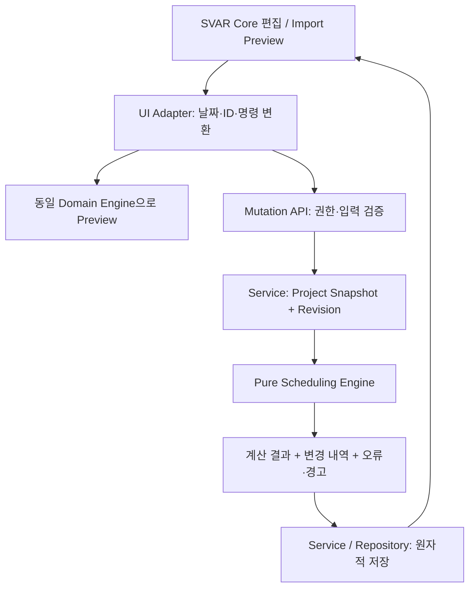

# Scheduling Engine 설계

상태: Bootstrap 설계 문서. 알고리즘·API·테스트는 아직 구현하지 않았다. 요구사항 출처는 [AGENTS.md](../AGENTS.md), 외부 입력 계약은 [IMPORT_SCHEMA.md](IMPORT_SCHEMA.md)이다.

## 1. 범위와 결정 구분

**Confirmed**: `src/domain/scheduling/`에 UI·DB와 독립적인 계산 계층을 둔다. 초기 범위는 Project Working Calendar, 주말·휴일 제외, 근무일 Duration, Summary 계산, FS Dependency, 의존 관계 재계산, WBS다. Server가 최종 결과를 계산하며 Client Preview에서도 같은 Pure Domain Logic을 사용한다.

**Assumption — 초기 설계 기준**: 일 단위 Gregorian 날짜, 양 끝 포함 구간, Project 공통 Calendar 한 개, `Asia/Seoul` 표시 기준, 토·일 비근무일, 사용자 설정 휴일 목록, FS/lag=0만 허용한다. 일반 업무의 Duration은 양의 정수 근무일이다. 업무는 `auto` 또는 `manual`이고 생략 시 `auto`로 정규화한다. 시각·반일·개별 업무 Calendar는 초기 범위에 없다.

**Manager 결정**: 입력 의도인 `requestedStart`와 계산 결과인 `start`를 분리한다. Summary를 Dependency Endpoint로 쓰지 않는다. Auto 일정의 비근무 시작일은 다음 근무일로 이동하고, Manual 일정의 비근무 시작일 또는 FS 위반은 전체 변경을 거부한다. Milestone을 포함한 모든 FS는 선행 종료일보다 뒤의 근무일에 후행 업무를 시작한다. 이는 본 시스템의 일 단위 규칙이며 다른 일정 도구와 동일한 의미라고 가정하지 않는다.

**Decision Required — 해당 확장 착수 시**: 시간 단위 Milestone 사건 의미, SS/FF/SF와 Lag/Lead, Summary Dependency, Manual 제약을 허용하는 경고 저장 정책, 여러 Calendar의 우선순위, Resource 용량·단위, CPM의 완료 목표일과 제약 모델. 초기 구현을 이 확장들의 결정까지 미루지 않는다.

## 2. 책임과 데이터 흐름



- Engine은 React, SVAR, SQLite, HTTP, Cookie, 파일·네트워크 I/O를 import하지 않는다. 현재 시각, 난수, 시스템 Timezone에 따라 결과가 달라져서도 안 된다.
- Service가 Project에 한정된 Task·Dependency·Calendar의 완전한 Snapshot을 읽는다. Engine은 인증·DB Transaction을 직접 수행하지 않는다.
- UI는 SVAR 공식 렌더러·편집 이벤트를 사용한다. 화면 이벤트를 Domain 입력으로 바꾸는 Adapter와 계산 계층을 분리한다. Core가 표시 가능한 기능과 본 시스템에서 저장 가능한 일정 제약은 서로 다른 계약이다.
- Client Preview는 참고 결과다. Server는 최신 Snapshot과 Calendar로 재검증·재계산하고 전체 변경을 Transaction으로 저장한다. Preview 이후 Revision이 달라졌으면 충돌 응답 후 다시 Preview한다. 정확한 HTTP 계약은 [API.md](API.md)에서 관리한다.
- Server 결과로 화면을 갱신한다. 낙관적 화면 변경이 거부되면 마지막 확정 Snapshot으로 복원하고 원인을 표시한다. 여러 SVAR 이벤트가 하나의 이동을 표현하더라도 Domain 변경을 중복 저장하지 않도록 Adapter에서 논리적 명령을 구성한다.

## 3. Domain 입력·출력 개념

아래는 설계용 개념이며 TypeScript 구현이나 별도 Import Schema가 아니다. Import Version은 `1.0`이며 필드의 필수 여부·JSON 형태는 [IMPORT_SCHEMA.md](IMPORT_SCHEMA.md)가 우선한다.

| 개념 | 의미와 불변 조건 |
| --- | --- |
| Task 식별 | Snapshot 내부의 안정적인 문자열 키. Import `externalId`를 Service가 대응한다. Project 밖의 ID는 허용하지 않는다. 행 번호·WBS를 참조 키로 쓰지 않는다. |
| `type` | `task`, `summary`, `milestone`만 허용한다. |
| `requestedStart` | 사용자가 요청한 시작일. Import·Mutation 입력의 `start`가 이 값으로 정규화된다. 저장하여 재계산 때 재사용한다. |
| `start`, `end` | Calendar와 Dependency 적용 후 확정되는 계산 날짜. API 조회 결과는 `requestedStart`와 구별하여 제공한다. |
| `duration` | Task는 정수 `>=1`, Milestone은 `0`, Summary는 하위 일정으로 계산한다. |
| `scheduleMode` | Leaf의 `auto` 또는 `manual`. Summary는 항상 파생 계산 대상이다. |
| `progress` | Leaf는 유한 숫자 `0..100`. Summary는 하위 Leaf에서 계산한다. |
| Parent·Sibling Order | Parent 참조와 저장된 형제 순서. Import 배열에서 같은 Parent의 등장 순서로 초기 순서를 만든다. |
| Dependency | 선행 Leaf → 후행 Leaf 방향. 초기 유효 값은 FS, lag=0. |
| Calendar | 토·일 제외, 중복 제거된 날짜별 Holiday 집합. Project 전체에 같은 버전을 적용한다. |
| Result | 새 Snapshot, 원본 대비 변경 Task, 날짜 이동 이유, 경고, 안정적인 오류 코드와 관련 Task ID. 실패하면 저장 가능한 부분 결과를 반환하지 않는다. |

`requestedStart`를 계산된 `start`로 자동 덮어쓰지 않는다. 예를 들어 B의 요청일이 9월 14일이고 A 때문에 9월 17일로 밀렸다면, A가 앞당겨졌을 때 B는 원래 요청일을 기준으로 다시 계산한다. 화면에서 사용자가 직접 시작일을 변경하는 명령만 새로운 요청일을 만든다. 별도 날짜 고정이 필요하면 `manual`을 사용한다.

## 4. Date-only와 Calendar

### 날짜 표현

입출력은 정확한 `YYYY-MM-DD` 문자열을 사용한다. 정규식뿐 아니라 Gregorian 윤년·월별 일수로 실제 날짜를 검증한다. `2026-02-30`, Timezone 접미사·시각이 붙은 값, 모호한 지역 날짜 문자열은 거부한다. 내부 연산은 검증된 연·월·일 또는 정수 Day Ordinal로 한다.

Local 자정 Timestamp 차이를 `86,400,000`으로 나누어 일수를 계산하지 않는다. DST가 있는 실행 환경에서도 하루를 Gregorian 날짜 하나로 센다. Browser `Date` 객체는 SVAR Adapter 경계에서만 생성·해석하고 `toISOString().slice(0, 10)`에 의존해 Local 날짜를 변환하지 않는다. Server의 저장·계산은 Browser 및 Container Timezone과 무관해야 한다.

`Asia/Seoul`은 Project의 표시·업무 날짜 기준이다. 문자열 `2026-09-11` 자체를 UTC Instant로 바꾸는 규칙이 아니다. Domain 날짜 표현의 범위는 네 자리 양의 Gregorian 연도이며, 범위 초과를 오류 처리한다. 실제 UI/Excel 호환 범위와 요청별 최대 기간·Task 수는 구현 착수 시 [API.md](API.md)의 입력 한도로 정렬한다.

### Calendar 연산 계약

| 개념 연산 | 정의 |
| --- | --- |
| `isWorkingDay(d)` | 날짜가 토·일이 아니고 Holiday 집합에도 없으면 참 |
| `nextWorkingDay(d, inclusive)` | `inclusive=true`이면 d부터, false이면 d 다음 날짜부터 첫 근무일 탐색 |
| `workingDaysBetween(s, e)` | s≤e인 구간의 양 끝을 포함하여 근무일 수 계산 |
| `endFromStart(s, n)` | 근무일 s를 첫날로 하여 n번째 근무일 반환. Task는 n≥1 |

Holiday는 조직이 설정한 날짜만 사용한다. 국가 공휴일이나 대체공휴일을 추측·자동 생성하지 않는다. 휴일이 주말과 겹쳐도 한 번만 제외하며, 휴일 목록의 잘못된 날짜는 거부한다. 전체 주간이 비근무일이 되는 미래 설정이나 유효 범위 내 근무일이 없는 탐색은 명확한 오류로 끝낸다. 일수·탐색 횟수 상한과 범위 검사는 무한 루프나 과도한 CPU 사용을 방지해야 한다.

## 5. Leaf Duration과 입력 검증 순서

일반 Task는 `requestedStart + duration`을 기준으로 한다. Milestone은 `duration=0`, 계산된 `start=end`다. Duration이 0인 일반 Task를 Milestone으로 조용히 변환하지 않는다. Progress 100이라고 날짜·Duration을 줄이지 않는다.

1. 입력 날짜, Type, Duration, Progress를 검증한다.
2. Auto의 비근무 요청일은 다음 근무일로 정규화하고 `NON_WORKING_START_SHIFTED` 경고를 만든다. Manual은 `NON_WORKING_MANUAL_START` 오류다.
3. 정규화한 요청 시작일과 Duration으로 **Dependency 적용 전 종료일**을 계산한다. Milestone은 이 시작일이 종료일이다.
4. 입력 `end`가 함께 제공되었다면 3번 결과와 정확히 같아야 한다. 다르면 `END_DURATION_MISMATCH`로 거부한다. end-only 입력이나 duration 역산의 허용 여부는 Import 계약에 따른다. 표준 Domain 입력에 모호한 두 기준을 남기지 않는다.
5. Dependency를 적용하여 최종 `start/end`를 구한다. 이 단계의 이동은 Preview 변경 내역이다. 이를 4번의 입력 불일치로 다시 판정하지 않는다.

Resize는 Adapter가 사용자가 선택한 구간을 근무일 Duration으로 정규화하는 명시적 명령이다. Engine이 화면의 Calendar-day Duration을 근무일 Duration으로 오인하지 않도록 한다. Summary 바를 직접 Resize하거나 Drag하여 자식 날짜를 암묵적으로 바꾸는 기능은 초기 범위에 없다.

## 6. Parent Tree, Summary와 WBS

Parent Tree와 Dependency Graph는 별개로 검증한다. Parent는 같은 Project에 존재하는 `summary`만 가능하다. 자기 Parent, Missing Parent, Parent Cycle을 거부한다. 일반 Task와 Milestone은 자식을 갖지 않는다. 잘못된 Type을 자동 변환하지 않는다.

초기 설계 가정으로 Empty Summary는 거부한다. Summary와 자식을 한 번의 변경으로 생성할 수 있으며 검증 대상은 변경 후 전체 Snapshot이다. 마지막 자식 삭제도 Summary 삭제·명시적 Type 변경을 포함하는 유효한 변경 묶음으로 처리한다. UI 명령 계약에서 이 동작을 지원해야 한다.

하위에서 상위 순서로 다음 값을 계산한다.

- `start`: 모든 하위 Leaf의 최소 시작일.
- `end`: 모든 하위 Leaf의 최대 종료일.
- `duration`: 위 구간의 근무일 수. 자식 Duration의 합이 아니다. Milestone만 같은 날짜에 있는 Summary도 구간 표현이므로 근무일 Span은 1이다.
- `progress`: 하위 일반 Task의 `sum(duration × progress) / sum(duration)`. 중첩 Summary의 Span을 가중치로 다시 더하지 않는다. Milestone은 Duration 0이므로 이 가중합에서 제외한다. 일반 Task가 전혀 없는 Summary는 하위 Milestone Progress의 산술 평균으로 계산한다. 계산 중간 값을 반올림하지 않고 표시 정밀도만 UI에서 처리한다.

Summary 입력 날짜·Duration·Progress를 최종 계산에 사용하지 않는다. Import에서 제공되었다면 원본과 파생 결과의 차이를 Preview로 알리는 방식은 [IMPORT_SCHEMA.md](IMPORT_SCHEMA.md)에 따른다. 자식 일정·진척·Parent 변경과 삭제 후 모든 조상 Summary를 다시 계산한다. 필터로 숨긴 자식도 계산에 포함한다.

WBS는 Parent Tree의 형제 순서에 따라 `1`, `1.1`, `1.2`, `2` 형태로 계산한다. Root도 저장된 순서를 따른다. 화면 정렬·필터는 저장 순서를 바꾸지 않는다. 명시적 Reorder·Reparent 후 WBS를 다시 계산한다. 배열에서 자식이 Parent보다 먼저 나와도 모든 ID를 먼저 등록하여 처리한다. WBS가 달라져도 External ID와 Dependency 참조는 유지된다.

## 7. FS Dependency와 Manual/Auto

초기 Endpoint는 일반 Task 또는 Milestone만 허용한다. Missing Target, 자기 연결, 중복 선행-후행 연결, Project 밖 참조, Summary Endpoint, Cycle을 거부한다. `SS`, `FF`, `SF`, 양수 Lag, 음수 Lead는 명시적인 미지원 오류로 반환한다. 입력을 FS/0으로 강제 변환하지 않는다.

선행 A → 후행 B의 FS/0 규칙은 다음과 같다.

```text
requiredStart(B, A) = A.end 이후 첫 근무일
lowerBound(B) = 모든 선행 업무의 requiredStart 중 최댓값
Auto B.start = max(Calendar로 정규화한 B.requestedStart, lowerBound(B))
Auto B.end = B.start와 Duration으로 재계산
```

선행이 없는 경우 요청 시작일만 사용한다. 모든 날짜는 같은 Project Calendar를 따르므로 여러 선행의 Bound도 근무일이다. 선행 변경, Dependency 추가·삭제, Duration·Calendar 변경 시 같은 규칙을 재적용한다.

Manual은 요청 날짜·Duration으로 계산한 구간을 고정한다. 들어오는 FS Bound를 만족하면 그대로 두고, 위반하면 `MANUAL_DEPENDENCY_CONFLICT`로 전체 변경을 거부한다. 선행 Manual의 종료일은 후행 Auto의 Bound 계산에 정상 참여한다. Manual도 그래프 Cycle·ID·날짜 검증에서 제외하지 않는다. Calendar 변경이 Manual 시작일이나 제약을 무효화하면 변경 전체를 거부하고 관련 Task를 알린다.

Manual 날짜 고정을 유지하기 위한 초기 설계 가정으로, Calendar 변경만으로 기존 Manual의 종료일이 달라지는 경우도 `MANUAL_CALENDAR_CONFLICT`로 거부한다. 예를 들어 9/11~9/14의 2일 Manual에 9/14 휴일을 추가하면 종료일을 9/15로 자동 변경하지 않는다. Service가 변경 전 확정 Snapshot과 변경 의도를 Pure 검증에 전달하여 전후 구간을 비교한다. 사용자가 그 Manual의 시작일·Duration을 명시적으로 수정한 경우는 새로운 요청 구간으로 검증할 수 있다. 이 비교에도 DB 접근을 Domain에 넣지 않는다.

Milestone은 특정 업무일의 사건을 나타내며 0일 Duration이다. 그러나 시간 순서를 표현하지 않는 초기 계약에서는 FS 선행의 종료일과 같은 날 후행 Milestone을 놓지 않는다. Milestone → Task 및 Milestone → Milestone 역시 다음 근무일 규칙을 사용한다. 향후 시간 단위 모델로 바꿀 때 Import Version과 마이그레이션 영향을 검토한다.

## 8. 재계산 절차와 복잡도

초기 구현은 작은 Project에 대해 전체 Snapshot을 결정적으로 재계산한다. 증분 계산 최적화는 측정 후 검토한다.

1. 입력을 복사·정규화하고 ID Map을 구성한다. 중복 ID·필드 오류를 수집한다.
2. Parent 참조·Type·Cycle을 검증하고 Children Map을 만든다. 깊은 트리는 반복형 순회로 처리한다.
3. Leaf 입력을 Calendar 기준으로 정규화하고 제공된 종료일을 검증한다.
4. Dependency의 Endpoint와 지원 Type을 검증하고 인접 목록·진입 차수를 만든다.
5. Kahn 위상 정렬로 Dependency DAG를 검증한다. 처리한 Leaf 수가 전체보다 작으면 Cycle 오류다. 잔여 노드 전체를 실제 Cycle 경로라고 보고하지 말고, 추가 DFS 등으로 실제 경로 또는 SCC를 추출하여 진단한다.
6. 위상 순서대로 선행 Bound를 합산하고 Auto 이동 또는 Manual 충돌을 계산한다. 같은 우선순위는 Snapshot의 안정적 순서로 처리한다.
7. Parent Tree를 후위 순회하여 Summary 값을 계산하고 전위 순회로 WBS를 부여한다.
8. 원본과 비교한 변경 내역과 이동 이유를 반환한다. Service가 Revision 확인 후 전체 변경을 원자적으로 저장한다.

Task 수 N, Dependency 수 E, Holiday 수 H일 때 ID·그래프 검증과 위상 정렬은 O(N+E), 저장 공간은 O(N+E+H)다. Calendar 비용은 별도다. 단순 날짜 순회라면 총 방문 날짜 수를 C라 할 때 전체 비용은 O(N+E+H+C)다. Span D에 대한 Calendar Prefix Count를 도입하면 전처리 O(D+H)와 메모리 O(D)가 추가되므로 그래프 계산만의 O(N+E)를 전체 성능으로 제시하지 않는다. WBS 문자열 생성 비용도 결과 문자열 총 길이에 비례한다.

입력 크기·기간·깊이 상한, 날짜 Overflow 검사, Cycle 조기 실패를 검증한다. 벤치마크 없이 SVAR의 렌더링 Task 수를 이 Engine의 처리 성능으로 인용하지 않는다.

## 9. 계산 예시

모든 예시는 토·일 휴무다. `2026-09-14`를 휴일로 지정한 예시는 **테스트용 조직 휴일**이며 실제 법정 공휴일이라는 뜻이 아니다.

| 상황 | 입력 | 기대 결과 |
| --- | --- | --- |
| 양 끝 포함 | 9/11(금), Task 1일, 휴일 없음 | start=end=9/11 |
| 주말 경계 | 9/11(금), Task 2일, 휴일 없음 | end=9/14(월) |
| 휴일 경계 | 9/11(금), Task 2일, 9/14 휴일 | end=9/15(화) |
| Auto 비근무 시작 | 요청 9/12(토), 1일, 휴일 없음 | start=end=9/14, 이동 경고 |
| Manual 비근무 시작 | 요청 9/12(토), 1일 | 전체 변경 거부 |
| FS와 휴일 | A.end=9/11, B 요청 9/11·2일, 9/14 휴일 | B.start=9/15, B.end=9/16 |
| 입력 end 검증 시점 | 위 B에 입력 end=9/15 | Calendar 기준 9/11+2일과 일치하여 유효; FS로 최종 9/16 이동 |
| 입력 불일치 | 위 B에 입력 end=9/16 | Dependency 전 종료일 9/15와 불일치하여 거부 |
| 여러 선행 | A.end=9/11, C.end=9/15, B 요청 9/11·1일 | B.start=end=9/16 |
| Manual FS 충돌 | A.end=9/15, Manual B.start=9/15 | 전체 변경 거부 |
| Milestone FS | M.start=end=9/11·0일, M→B, 휴일 없음 | B의 가장 빠른 시작은 9/14 |
| Milestone 연쇄 | M1=9/11, M1→M2, 휴일 없음 | M2.start=end=9/14, Duration 0 유지 |
| Summary Span·진척 | A=9/11·1일·100%, B=9/15~16·2일·0%, 휴일 없음 | Summary 9/11~16, 4근무일, Progress 100/3% |
| 순수 Milestone Summary | 같은 날짜 Milestone 2개, Progress 0%와 100% | Span 1근무일, Progress 50% |

## 10. 구현 시 필수 검증

상태는 모두 **NOT TESTED — 설계 단계**다. 계산 구현과 동시에 Vitest Unit Test를 작성하며 [TEST_PLAN.md](TEST_PLAN.md)에 실행 결과를 연결한다.

| 영역 | 필수 검증 |
| --- | --- |
| 날짜 | 윤년 2028-02-29 허용, 2026-02-29 거부, 월말·연말, 날짜 범위 Overflow, 시각 포함 문자열 거부 |
| Calendar | 주말, 연속 Holiday, 주말과 Holiday 중복, 비근무 시작 Auto/Manual, 탐색 상한 |
| Duration | 1일, 장기 기간, 0/음수/소수 Task 거부, Milestone 0일, end 불일치, Dependency 전 검증 순서 |
| Graph | 단일 FS, 여러 선행, 분기·합류, 자기 연결, 중복 연결, Missing Target, Summary Endpoint, SS/FF/SF/Lag/Lead 거부 |
| Cycle | Parent Cycle과 Dependency Cycle 각각, Manual을 통과하는 Cycle, Cycle 뒤에 붙은 비순환 노드를 오진하지 않는 오류 경로 |
| Summary | 중첩, 자식 이동·삭제·Reparent, 숨긴 자식 포함, 가중 진척, Milestone-only, Empty Summary 거부 |
| WBS | 비연속 Import 배열, Parent 뒤에 나온 자식·앞에 나온 자식, Reorder, Reparent, UI Sort/Filter로 불변 |
| 재계산 | 선행을 뒤·앞으로 이동, 연결 삭제로 복귀, Calendar 변경, 동일 입력의 동일 결과, 재계산 멱등성 |
| Mixed Mode | Manual 유지, Manual 선행→Auto 후행, Auto 선행→Manual 충돌, Calendar만 변경 시 Manual 종료 이동 거부, 명시적 Manual 수정, 전체 실패 시 원본 Snapshot 불변 |
| 경계 통합 | Server/Browser 동일 Fixture 결과, UTC·Asia/Seoul·DST Timezone에서 Date-only 왕복, SVAR inclusive/exclusive End Adapter |
| 저장 | 권한 없는 호출 거부, Project 격리, Revision 충돌, 오류 시 전체 Rollback, 저장 후 재조회·Preview 결과 일치 |

성질 기반 검증 후보: 유효 일반 Task의 `workingDaysBetween(start,end)=duration`, 모든 Leaf Endpoint가 근무일, 모든 FS Bound 만족, Summary가 하위 Leaf를 포함, 원본 입력 불변, 계산 결과를 같은 요청값으로 재계산해도 날짜가 더 밀리지 않음.

## 11. 향후 확장 경계

SS/FF/SF와 Lag/Lead는 Constraint 모델을 먼저 정의하고 Formula·Cycle·Calendar 단위 검증을 추가한다. Baseline은 별도 불변 Snapshot으로 보관하여 현재 일정 재계산이 수정하지 않도록 한다. CPM은 Forward/Backward Pass와 목표 완료 경계, Total Slack·Free Slack의 근무일 정의를 확정한 후 구현한다. Manual 날짜 제약이 있는 네트워크에서 잘못된 Critical 표시를 내지 않는 것이 우선이다.

Grouping은 표시 그룹과 실제 Parent Tree를 구분한다. Resource Assignment·Workload·Calendar는 단위·용량·겹침·다중 Calendar 충돌 정책이 필요하다. Rollup은 표시 집계와 Summary 계산을 구분하고, Split Task는 Segment 목록과 Duration·Dependency Endpoint의 의미를 별도 계약으로 확장한다. 이들은 초기 FS 모델의 숨은 옵션으로 구현하지 않는다.

관련 범위와 공식 기능 근거는 [PRO_FEATURE_MATRIX.md](PRO_FEATURE_MATRIX.md), 저장 책임은 [ARCHITECTURE.md](ARCHITECTURE.md)와 [DB_SCHEMA.md](DB_SCHEMA.md)에 연결한다.
