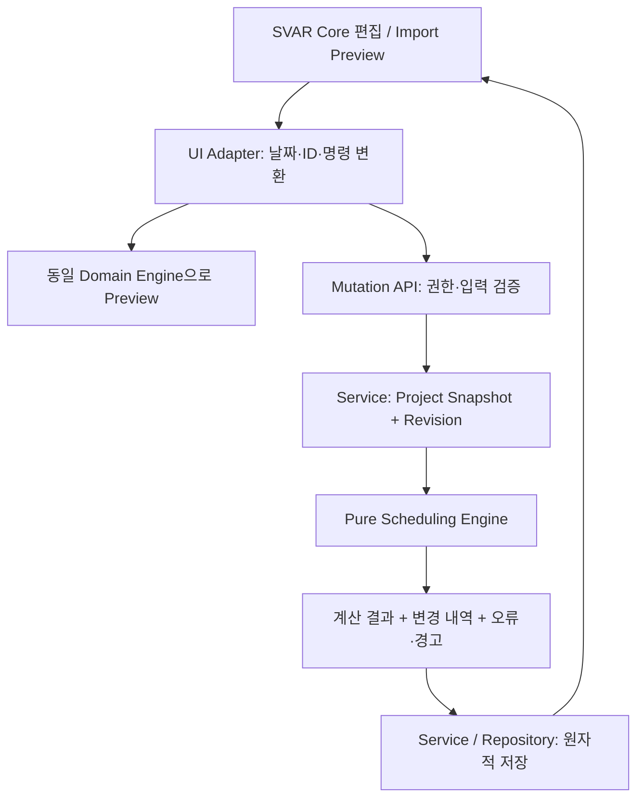

# Scheduling Engine 설계

상태: W06 Working Calendar/Duration과 W07 root Leaf/Milestone 저장 연결을 기반으로, Issue #57에서 Working Calendar를 `Base weekly rule + WORKING/NON_WORKING date exception`으로 일반화하고 Project Calendar Preview/저장 및 Resource Effective Calendar를 연결했다. Gregorian date-only, 근무일 연산과 Leaf/Summary 계산은 `src/domain/scheduling/`의 pure API를 유지한다. W24의 Summary/WBS 계층 계산을 유지하며 Issue #68에서 Calendar mutation 경로에 `FS/lag=0` Dependency forward-pass를 연결했다. 근거는 [W06_REVIEW.md](W06_REVIEW.md), [W07_REVIEW.md](W07_REVIEW.md), 외부 입력 계약은 [IMPORT_SCHEMA.md](IMPORT_SCHEMA.md)이다.

## 1. 범위와 결정 구분

**Confirmed**: `src/domain/scheduling/`에 UI·DB와 독립적인 계산 계층을 둔다. 초기 범위는 Project Working Calendar, 주말·휴일 제외, 근무일 Duration, Summary 계산, FS Dependency, 의존 관계 재계산, WBS다. Server가 최종 결과를 계산하며 Client Preview에서도 같은 Pure Domain Logic을 사용한다.

**구현 기준**: 일 단위 Gregorian 날짜, 양 끝 포함 구간, `Asia/Seoul` 표시 기준과 월~금 근무/토·일 휴무의 Base weekly rule을 사용한다. Issue #57부터 Project Calendar는 여러 국가 규칙과 Project Custom 휴무를 날짜 예외로 결합하며, 명시적 `WORKING/NON_WORKING` 예외가 기본 주간 규칙보다 우선한다. FS/lag=0 경계는 기존과 같다. 일반 업무의 Duration은 양의 정수 근무일이다. 업무는 `auto` 또는 `manual`이고 생략 시 `auto`로 정규화한다. 시각·반일·개별 업무 Calendar는 초기 범위에 없다.

**Manager 결정**: 입력 의도인 `requestedStart`와 계산 결과인 `start`를 분리한다. Summary를 Dependency Endpoint로 쓰지 않는다. Auto 일정의 비근무 시작일은 다음 근무일로 이동하고, Manual 일정의 비근무 시작일 또는 FS 위반은 전체 변경을 거부한다. Milestone을 포함한 모든 FS는 선행 종료일보다 뒤의 근무일에 후행 업무를 시작한다. 이는 본 시스템의 일 단위 규칙이며 다른 일정 도구와 동일한 의미라고 가정하지 않는다.

**Decision Required — 해당 확장 착수 시**: 시간 단위 Milestone 사건 의미, SS/FF/SF와 Lag/Lead, Summary Dependency, Manual 제약을 허용하는 경고 저장 정책, 여러 Calendar의 우선순위, Resource 용량·단위, CPM의 완료 목표일과 제약 모델. 초기 구현을 이 확장들의 결정까지 미루지 않는다.

## 2. 책임과 데이터 흐름



- Engine은 React, SVAR, SQLite, HTTP, Cookie, 파일·네트워크 I/O를 import하지 않는다. 현재 시각, 난수, 시스템 Timezone에 따라 결과가 달라져서도 안 된다.
- Service가 Project에 한정된 Task·Dependency·Calendar의 완전한 Snapshot을 읽는다. Engine은 인증·DB Transaction을 직접 수행하지 않는다.
- UI는 SVAR 공식 렌더러·편집 이벤트를 사용한다. 화면 이벤트를 Domain 입력으로 바꾸는 Adapter와 계산 계층을 분리한다. Core가 표시 가능한 기능과 본 시스템에서 저장 가능한 일정 제약은 서로 다른 계약이다.
- Client Preview는 참고 결과다. Server는 최신 Snapshot과 Calendar로 재검증·재계산하고 전체 변경을 Transaction으로 저장한다. Preview 이후 Revision이 달라졌으면 충돌 응답 후 다시 Preview한다. 정확한 HTTP 계약은 [API.md](API.md)에서 관리한다.
- Server 결과로 화면을 갱신한다. 낙관적 화면 변경이 거부되면 마지막 확정 Snapshot으로 복원하고 원인을 표시한다. 여러 SVAR 이벤트가 하나의 이동을 표현하더라도 Domain 변경을 중복 저장하지 않도록 Adapter에서 논리적 명령을 구성한다.

## 3. Domain 입력·출력 개념

아래는 설계용 개념이며 TypeScript 구현이나 별도 Import Schema가 아니다. Import Version은 `1.0`이며 필드의 필수 여부·JSON 형태는 [IMPORT_SCHEMA.md](IMPORT_SCHEMA.md)가 우선한다.

| 개념 | 의미와 불변 조건 |
| --- | --- |
| Task 식별 | Snapshot 내부의 안정적인 문자열 키. Import `externalId`를 Service가 대응한다. Project 밖의 ID는 허용하지 않는다. 행 번호·WBS를 참조 키로 쓰지 않는다. |
| `type` | `task`, `summary`, `milestone`만 허용한다. |
| `requestedStart` | 사용자가 요청한 시작일. Import·Mutation 입력의 `start`가 이 값으로 정규화된다. 저장하여 재계산 때 재사용한다. |
| `start`, `end` | Calendar와 Dependency 적용 후 확정되는 계산 날짜. API 조회 결과는 `requestedStart`와 구별하여 제공한다. |
| `duration` | Task는 정수 `>=1`, Milestone은 `0`, Summary는 하위 일정으로 계산한다. |
| `scheduleMode` | Leaf의 `auto` 또는 `manual`. Summary는 항상 파생 계산 대상이다. |
| `progress` | Leaf는 유한 숫자 `0..100`. Summary는 하위 Leaf에서 계산한다. |
| Parent·Sibling Order | Parent 참조와 저장된 형제 순서. Import 배열에서 같은 Parent의 등장 순서로 초기 순서를 만든다. |
| Dependency | 선행 Leaf → 후행 Leaf 방향. 초기 유효 값은 FS, lag=0. |
| Calendar | Base weekly rule + 날짜별 `NON_WORKING/WORKING` 예외. Project 일정에는 Project target rule만 사용하고 Resource workload에는 Group/Resource NON_WORKING을 추가 union한다. |
| Result | 새 Snapshot, 원본 대비 변경 Task, 날짜 이동 이유, 경고, 안정적인 오류 코드와 관련 Task ID. 실패하면 저장 가능한 부분 결과를 반환하지 않는다. |

`requestedStart`를 계산된 `start`로 자동 덮어쓰지 않는다. 예를 들어 B의 요청일이 9월 14일이고 A 때문에 9월 17일로 밀렸다면, A가 앞당겨졌을 때 B는 원래 요청일을 기준으로 다시 계산한다. 화면에서 사용자가 직접 시작일을 변경하는 명령만 새로운 요청일을 만든다. 별도 날짜 고정이 필요하면 `manual`을 사용한다.

## 4. Date-only와 Calendar

### 날짜 표현

입출력은 정확한 `YYYY-MM-DD` 문자열을 사용한다. 정규식뿐 아니라 Gregorian 윤년·월별 일수로 실제 날짜를 검증한다. `2026-02-30`, Timezone 접미사·시각이 붙은 값, 모호한 지역 날짜 문자열은 거부한다. 내부 연산은 검증된 연·월·일 또는 정수 Day Ordinal로 한다.

Local 자정 Timestamp 차이를 `86,400,000`으로 나누어 일수를 계산하지 않는다. DST가 있는 실행 환경에서도 하루를 Gregorian 날짜 하나로 센다. Browser `Date` 객체는 SVAR Adapter 경계에서만 생성·해석하고 `toISOString().slice(0, 10)`에 의존해 Local 날짜를 변환하지 않는다. Server의 저장·계산은 Browser 및 Container Timezone과 무관해야 한다.

`Asia/Seoul`은 Project의 표시·업무 날짜 기준이다. 문자열 `2026-09-11` 자체를 UTC Instant로 바꾸는 규칙이 아니다. W06 Domain 지원 범위는 [API.md](API.md)의 초기 상한과 같은 `1900-01-01..2199-12-31`이며 전체 109,573일을 절대 탐색 상한으로 사용한다. 일반 Task duration은 정수 `1..10000`이다. 날짜 또는 계산 결과가 범위를 벗어나면 구조화된 오류로 종료한다.

### Calendar 연산 계약

| 개념 연산 | 정의 |
| --- | --- |
| `isWorkingDay(d)` | 명시적 날짜 예외가 있으면 그 `dayType`을 사용하고, 없으면 월~금 true / 토·일 false |
| `nextWorkingDay(d, inclusive)` | `inclusive=true`이면 d부터, false이면 d 다음 날짜부터 첫 근무일 탐색 |
| `workingDaysBetween(s, e)` | s≤e인 구간의 양 끝을 포함하여 Effective Calendar의 근무일 수 계산 |
| `endFromStart(s, n)` | 근무일 s를 첫날로 하여 n번째 Effective 근무일 반환. Task는 n≥1 |

`NON_WORKING`은 평일도 휴무로 만들고 `WORKING`은 기본 주말도 근무일로 만든다. 날짜별 명시 예외가 Base weekly rule보다 우선한다. 기존 `holidays` 입력은 하위 호환을 위해 모두 `NON_WORKING` exception으로 정규화한다. 동일 Calendar input에서 같은 날짜가 중복되거나 서로 충돌하면 암묵적으로 선택하지 않고 오류로 거부한다. 국가 데이터 생성·출처 선택은 Scheduling Domain 밖의 서버 Calendar 계층이 담당하며 Engine은 정규화된 exception만 입력받는다. 성공한 Calendar는 날짜순 고유 목록을 복사·동결한다. 전체 범위가 비근무일이어도 최대 지원 범위 안에서 종료하고 근무일을 찾지 못했다는 오류를 반환한다.

### W06 공개 Domain API

`src/domain/scheduling/index.ts`는 다음 pure API와 상한을 공개한다.

- `parseDateOnly`, ordinal 변환·가감·요일: strict Gregorian label과 범위 검사
- `createWorkingCalendar`: exact `Asia/Seoul`, exact weekend `[6,0]`, legacy Holiday 및 `WORKING/NON_WORKING` exception 검증·정렬·불변 복사
- `isWorkingDay`, `nextWorkingDay`, `workingDaysBetween`, `endFromStart`: 양 끝 포함 근무일 연산
- `scheduleLeaf`: `requestedStart` 보존, Auto 비근무 시작 이동 warning, Manual 거부, Task/Milestone와 dependency 전 optional end 검증
- `recalculateFinishStartDependencies`: calendar-normalized Leaf와 FS/lag=0 graph를 검증하고 Kahn forward-pass로 Auto 일정 이동 및 Manual lower-bound conflict를 계산
- `SchedulingError`: 안정적인 `code`와 제한된 `field/date/expectedDate/index` context
- `MIN_SUPPORTED_DATE`, `MAX_SUPPORTED_DATE`, `MAX_CALENDAR_SPAN_DAYS`, `MAX_TASK_DURATION`, `MAX_CALENDAR_HOLIDAYS`, `MAX_CALENDAR_EXCEPTIONS`: 실행 가능한 자원 경계

구현은 자체 Gregorian ordinal을 사용하며 `Date`, `Date.parse`, `Intl`, system timezone, 현재 시각, React, SVAR, DB, HTTP 또는 I/O를 import하지 않는다. Calendar 조회는 날짜 방문 수 `D`와 정렬 Holiday의 이진 검색 `O(log H)`를 사용하며 `D≤109573`이다.

## 5. Leaf Duration과 입력 검증 순서

일반 Task는 `requestedStart + duration`을 기준으로 한다. Milestone은 `duration=0`, 계산된 `start=end`다. Duration이 0인 일반 Task를 Milestone으로 조용히 변환하지 않는다. Progress 100이라고 날짜·Duration을 줄이지 않는다.

아래 순서는 hierarchy와 dependency를 포함한 전체 Engine의 목표 순서다. W06 `scheduleLeaf`는 date/type/duration/mode/optional end만 입력받으며 progress, hierarchy와 dependency 검증은 W07–W09에서 이 순서에 연결한다.

1. 입력 날짜, Type, Duration, Progress를 검증한다.
2. Auto의 비근무 요청일은 다음 근무일로 정규화하고 `NON_WORKING_START_SHIFTED` 경고를 만든다. Manual은 `NON_WORKING_MANUAL_START` 오류다.
3. 정규화한 요청 시작일과 Duration으로 **Dependency 적용 전 종료일**을 계산한다. Milestone은 이 시작일이 종료일이다.
4. 입력 `end`가 함께 제공되었다면 3번 결과와 정확히 같아야 한다. 다르면 `END_DURATION_MISMATCH`로 거부한다. end-only 입력이나 duration 역산의 허용 여부는 Import 계약에 따른다. 표준 Domain 입력에 모호한 두 기준을 남기지 않는다.
5. Dependency를 적용하여 최종 `start/end`를 구한다. 이 단계의 이동은 Preview 변경 내역이다. 이를 4번의 입력 불일치로 다시 판정하지 않는다.

Resize는 Adapter가 사용자가 선택한 구간을 근무일 Duration으로 정규화하는 명시적 명령이다. Engine이 화면의 Calendar-day Duration을 근무일 Duration으로 오인하지 않도록 한다. Summary 바를 직접 Resize하거나 Drag하여 자식 날짜를 암묵적으로 바꾸는 기능은 초기 범위에 없다.

## 6. Parent Tree, Summary와 WBS

Parent Tree와 Dependency Graph는 별개로 검증한다. 최종 Snapshot의 Parent는 같은 Project에 존재하는 `summary`만 가능하다. 자기 Parent, Missing Parent, Parent Cycle을 거부한다. 일반 Task와 Milestone은 자식을 갖지 않는다. 잘못된 Type을 Engine에서 자동 변환하지 않는다. W24의 첫 하위 작업 추가는 UI 확인과 명시적 `convertParentToSummary: true` 명령을 받은 Service가 기존 일반 Task를 Summary로 바꾸고 자식을 함께 생성하는 원자적 변경이다. Milestone은 Parent로 전환하지 않는다.

Empty Summary는 거부한다. Summary와 자식을 한 번의 변경으로 생성할 수 있으며 검증 대상은 변경 후 전체 Snapshot이다. W24에서는 마지막 자식 삭제 및 Summary 직접 삭제를 거부하여 Empty Summary 또는 암묵적인 하위 전체 삭제가 발생하지 않게 한다. 향후 마지막 자식 삭제를 허용하려면 Summary 삭제·명시적 Type 변경을 포함하는 유효한 변경 묶음과 별도 UI 명령 계약이 필요하다.

하위에서 상위 순서로 다음 값을 계산한다.

- `start`: 모든 하위 Leaf의 최소 시작일.
- `end`: 모든 하위 Leaf의 최대 종료일.
- `duration`: 위 구간의 근무일 수. 자식 Duration의 합이 아니다. Milestone만 같은 날짜에 있는 Summary도 구간 표현이므로 근무일 Span은 1이다.
- `progress`: 하위 일반 Task의 `sum(duration × progress) / sum(duration)`. 중첩 Summary의 Span을 가중치로 다시 더하지 않는다. Milestone은 Duration 0이므로 이 가중합에서 제외한다. 일반 Task가 전혀 없는 Summary는 하위 Milestone Progress의 산술 평균으로 계산한다. 계산 중간 값을 반올림하지 않고 표시 정밀도만 UI에서 처리한다.

Summary 입력 날짜·Duration·Progress를 최종 계산에 사용하지 않는다. Import에서 제공되었다면 원본과 파생 결과의 차이를 Preview로 알리는 방식은 [IMPORT_SCHEMA.md](IMPORT_SCHEMA.md)에 따른다. 자식 일정·진척·Parent 변경과 삭제 후 모든 조상 Summary를 다시 계산한다. 필터로 숨긴 자식도 계산에 포함한다.

WBS는 Parent Tree의 형제 순서에 따라 `1`, `1.1`, `1.2`, `2` 형태로 계산한다. Root도 저장된 순서를 따른다. 화면 정렬·필터는 저장 순서를 바꾸지 않는다. 명시적 Reorder·Reparent 후 WBS를 다시 계산한다. 배열에서 자식이 Parent보다 먼저 나와도 모든 ID를 먼저 등록하여 처리한다. WBS가 달라져도 External ID와 Dependency 참조는 유지된다.

### W24 공개 계층 API와 계산 경계

`recalculateHierarchy(tasks, calendar)`는 canonical Leaf 일정과 변경 후 전체 Project Task Snapshot을 받아 Summary와 WBS를 계산한다. 입력 필드는 `taskId`, `externalId`, `parentExternalId`, `siblingOrder`, `type`, `requestedStart`, `start`, `end`, `duration`, `progress`, `scheduleMode`다. 다른 DTO 필드를 보존하며 입력 배열 순서를 유지한 새 동결 배열과 새 동결 Task 객체를 반환한다. WBS는 Domain 결과에 포함하지만 W24 HTTP DTO에 새 필드를 요구하지 않는다.

- Service는 변경 Leaf를 `scheduleLeaf`로 먼저 계산하고 명시적인 Task→Summary 전환을 완료한 Snapshot을 전달한다. Engine은 Parent/Type을 바꾸지 않고 Leaf를 다시 스케줄하지 않는다.
- Summary의 기존 날짜·기간·진척·모드는 계산에 사용하지 않는다. 결과는 하위 Leaf만을 집계하며 `scheduleMode: auto`, `requestedStart: null`이다. 중첩 Summary의 중간 진척률을 반올림하거나 Span을 가중치로 중복 집계하지 않는다.
- Leaf 시작/종료 날짜는 유효한 근무일이어야 하며 기간과 양 끝 포함 근무일 수가 일치해야 한다. Milestone은 기간 0, 시작=종료다. Leaf Progress는 유한한 `0..100`이다. 자동/수동 요청 시작일의 실제 스케줄 정규화는 앞 단계 `scheduleLeaf`의 책임이다.
- ID와 External ID는 각각 유일하고 Parent는 Snapshot 안의 Summary여야 한다. 형제 순서는 0 이상 Safe Integer이고 같은 Parent 안에서 중복할 수 없다. 삭제로 생긴 번호 간격은 허용하며 WBS 표시 번호는 형제 정렬 순서로 다시 계산한다.
- 상한은 기존 API 기준으로 `MAX_HIERARCHY_TASKS=5000`, `MAX_HIERARCHY_DEPTH=64`(Root 깊이 1)다. 배열이 비었으면 유효한 빈 결과다. 순환·부모 누락·빈 Summary·상한 초과는 `SchedulingError`로 전체 실패한다. 부분 결과는 반환하지 않는다.
- ID Map과 Root-first 반복 순회로 Parent Graph를 검증한다. 방문하지 못한 노드가 있으면 Parent Cycle이며 잔여 모든 노드를 실제 Cycle 경로라고 과대 표시하지 않는다. 역순 순회로 조상 집계를 수행해 JavaScript 재귀 Stack에 의존하지 않는다.
- Leaf 전체 날짜 Span에 근무일 Prefix Count를 한 번 작성한다. Calendar Span은 기존 날짜 범위 안의 최대 109,573일이며 Summary Span/Leaf 기간 검증은 Prefix 조회로 처리한다. 형제 정렬을 포함한 비용은 `O(N log N + D log(H+1) + W)`, 메모리는 `O(N + D + W)`다. N은 Task 수, D는 전체 날짜 Span, H는 Holiday 수, W는 WBS 문자열 총 길이다. Calendar Prefix를 제외한 알고리즘만 O(N)이라고 전체 성능을 표시하지 않는다.

`tests/domain/scheduling/hierarchy.test.ts`는 중첩 집계, 비정수 진척, 순수 Milestone 평균, 주말·휴일 경계, 자식 갱신·삭제 후 조상 재계산, WBS와 비연속 입력 순서, 순환/부모 누락/잘못된 Type/빈 Summary, 형제 중복, 날짜·기간·진척 검증, 깊이·노드 상한 및 입력 불변/멱등성을 검증한다. Dependency, Reparent, Calendar 변경은 W24 계층 함수의 범위에 포함하지 않는다. API 권한·Revision·원자적 저장은 Service 통합 테스트에서 별도로 검증한다.

## 7. FS Dependency와 Manual/Auto

초기 Endpoint는 일반 Task 또는 Milestone만 허용한다. Missing Target, 자기 연결, 중복 선행-후행 연결, Project 밖 참조, Summary Endpoint, Cycle을 거부한다. `SS`, `FF`, `SF`, 양수 Lag, 음수 Lead는 명시적인 미지원 오류로 반환한다. 입력을 FS/0으로 강제 변환하지 않는다.

선행 A → 후행 B의 FS/0 규칙은 다음과 같다.

```text
requiredStart(B, A) = A.end 이후 첫 근무일
lowerBound(B) = 모든 선행 업무의 requiredStart 중 최댓값
Auto B.start = max(Calendar로 정규화한 B.requestedStart, lowerBound(B))
Auto B.end = B.start와 Duration으로 재계산
```

선행이 없는 경우 요청 시작일만 사용한다. 모든 날짜는 같은 Project Calendar를 따르므로 여러 선행의 Bound도 근무일이다. 선행 변경, Dependency 추가·삭제, Duration·Calendar 변경 시 같은 규칙을 재적용한다.

Manual은 요청 날짜·Duration으로 계산한 구간을 고정한다. 들어오는 FS Bound를 만족하면 그대로 두고, 위반하면 `MANUAL_DEPENDENCY_CONFLICT`로 전체 변경을 거부한다. 선행 Manual의 종료일은 후행 Auto의 Bound 계산에 정상 참여한다. Manual도 그래프 Cycle·ID·날짜 검증에서 제외하지 않는다. Calendar 변경이 Manual 시작일이나 제약을 무효화하면 변경 전체를 거부하고 관련 Task를 알린다.

Manual 날짜 고정을 유지하기 위한 초기 설계 가정으로, Calendar 변경만으로 기존 Manual의 종료일이 달라지는 경우도 `MANUAL_CALENDAR_CONFLICT`로 거부한다. 예를 들어 9/11~9/14의 2일 Manual에 9/14 휴일을 추가하면 종료일을 9/15로 자동 변경하지 않는다. Service가 변경 전 확정 Snapshot과 변경 의도를 Pure 검증에 전달하여 전후 구간을 비교한다. 사용자가 그 Manual의 시작일·Duration을 명시적으로 수정한 경우는 새로운 요청 구간으로 검증할 수 있다. 이 비교에도 DB 접근을 Domain에 넣지 않는다.

Milestone은 특정 업무일의 사건을 나타내며 0일 Duration이다. 그러나 시간 순서를 표현하지 않는 초기 계약에서는 FS 선행의 종료일과 같은 날 후행 Milestone을 놓지 않는다. Milestone → Task 및 Milestone → Milestone 역시 다음 근무일 규칙을 사용한다. 향후 시간 단위 모델로 바꿀 때 Import Version과 마이그레이션 영향을 검토한다.

## 8. 재계산 절차와 복잡도

초기 구현은 작은 Project에 대해 전체 Snapshot을 결정적으로 재계산한다. 증분 계산 최적화는 측정 후 검토한다.

1. 입력을 복사·정규화하고 ID Map을 구성한다. 중복 ID·필드 오류를 수집한다.
2. Parent 참조·Type·Cycle을 검증하고 Children Map을 만든다. 깊은 트리는 반복형 순회로 처리한다.
3. Leaf 입력을 Calendar 기준으로 정규화하고 제공된 종료일을 검증한다.
4. Dependency의 Endpoint와 지원 Type을 검증하고 인접 목록·진입 차수를 만든다.
5. Kahn 위상 정렬로 Dependency DAG를 검증한다. 처리한 Leaf 수가 전체보다 작으면 Cycle 오류다. 잔여 노드 전체를 실제 Cycle 경로라고 보고하지 말고, 추가 DFS 등으로 실제 경로 또는 SCC를 추출하여 진단한다.
6. 위상 순서대로 선행 Bound를 합산하고 Auto 이동 또는 Manual 충돌을 계산한다. 같은 우선순위는 Snapshot의 안정적 순서로 처리한다.
7. Parent Tree를 후위 순회하여 Summary 값을 계산하고 전위 순회로 WBS를 부여한다.
8. 원본과 비교한 변경 내역과 이동 이유를 반환한다. Service가 Revision 확인 후 전체 변경을 원자적으로 저장한다.

Task 수 N, Dependency 수 E, Holiday 수 H일 때 ID·그래프 검증과 위상 정렬은 O(N+E), 저장 공간은 O(N+E+H)다. Calendar 비용은 별도다. 단순 날짜 순회라면 총 방문 날짜 수를 C라 할 때 전체 비용은 O(N+E+H+C)다. Span D에 대한 Calendar Prefix Count를 도입하면 전처리 O(D+H)와 메모리 O(D)가 추가되므로 그래프 계산만의 O(N+E)를 전체 성능으로 제시하지 않는다. WBS 문자열 생성 비용도 결과 문자열 총 길이에 비례한다.

입력 크기·기간·깊이 상한, 날짜 Overflow 검사, Cycle 조기 실패를 검증한다. 벤치마크 없이 SVAR의 렌더링 Task 수를 이 Engine의 처리 성능으로 인용하지 않는다.

## 9. 계산 예시

모든 예시는 토·일 휴무다. `2026-09-14`를 휴일로 지정한 예시는 **테스트용 조직 휴일**이며 실제 법정 공휴일이라는 뜻이 아니다.

| 상황 | 입력 | 기대 결과 |
| --- | --- | --- |
| 양 끝 포함 | 9/11(금), Task 1일, 휴일 없음 | start=end=9/11 |
| 주말 경계 | 9/11(금), Task 2일, 휴일 없음 | end=9/14(월) |
| 휴일 경계 | 9/11(금), Task 2일, 9/14 휴일 | end=9/15(화) |
| Auto 비근무 시작 | 요청 9/12(토), 1일, 휴일 없음 | start=end=9/14, 이동 경고 |
| Manual 비근무 시작 | 요청 9/12(토), 1일 | 전체 변경 거부 |
| FS와 휴일 | A.end=9/11, B 요청 9/11·2일, 9/14 휴일 | B.start=9/15, B.end=9/16 |
| 입력 end 검증 시점 | 위 B에 입력 end=9/15 | Calendar 기준 9/11+2일과 일치하여 유효; FS로 최종 9/16 이동 |
| 입력 불일치 | 위 B에 입력 end=9/16 | Dependency 전 종료일 9/15와 불일치하여 거부 |
| 여러 선행 | A.end=9/11, C.end=9/15, B 요청 9/11·1일 | B.start=end=9/16 |
| Manual FS 충돌 | A.end=9/15, Manual B.start=9/15 | 전체 변경 거부 |
| Milestone FS | M.start=end=9/11·0일, M→B, 휴일 없음 | B의 가장 빠른 시작은 9/14 |
| Milestone 연쇄 | M1=9/11, M1→M2, 휴일 없음 | M2.start=end=9/14, Duration 0 유지 |
| Summary Span·진척 | A=9/11·1일·100%, B=9/15~16·2일·0%, 휴일 없음 | Summary 9/11~16, 4근무일, Progress 100/3% |
| 순수 Milestone Summary | 같은 날짜 Milestone 2개, Progress 0%와 100% | Span 1근무일, Progress 50% |

## 10. 구현 시 필수 검증

W06 범위인 날짜·Calendar·Leaf Duration·Milestone·단일 Leaf Manual 시작과 runtime 결정성은 **PASS**다. W07에서는 지원 범위인 root Leaf/Milestone 저장의 권한·Project 격리·Revision 충돌·Rollback·재조회 일치까지 **PASS**했다. W24의 Pure Parent Graph/Cycle/Summary/WBS와 계층 입력 불변·상한은 Domain Unit Test로 검증한다. 아래 표는 전체 Scheduling Engine의 최종 검증 목표이며 Dependency 기반 재계산·저장, Reparent와 Calendar 변경은 아직 후속 범위다. W06 자동화 증거는 [W06_REVIEW.md](W06_REVIEW.md), W07 저장 증거는 [W07_REVIEW.md](W07_REVIEW.md)에 기록한다.

| 영역 | 필수 검증 |
| --- | --- |
| 날짜 | 윤년 2028-02-29 허용, 2026-02-29 거부, 월말·연말, 날짜 범위 Overflow, 시각 포함 문자열 거부 |
| Calendar | 주말, 연속 Holiday, 주말과 Holiday 중복, 비근무 시작 Auto/Manual, 탐색 상한 |
| Duration | 1일, 장기 기간, 0/음수/소수 Task 거부, Milestone 0일, end 불일치, Dependency 전 검증 순서 |
| Graph | 단일 FS, 여러 선행, 분기·합류, 자기 연결, 중복 연결, Missing Target, Summary Endpoint, SS/FF/SF/Lag/Lead 거부 |
| Cycle | Parent Cycle과 Dependency Cycle 각각, Manual을 통과하는 Cycle, Cycle 뒤에 붙은 비순환 노드를 오진하지 않는 오류 경로 |
| Summary | 중첩, 자식 이동·삭제·Reparent, 숨긴 자식 포함, 가중 진척, Milestone-only, Empty Summary 거부 |
| WBS | 비연속 Import 배열, Parent 뒤에 나온 자식·앞에 나온 자식, Reorder, Reparent, UI Sort/Filter로 불변 |
| 재계산 | 선행을 뒤·앞으로 이동, 연결 삭제로 복귀, Calendar 변경, 동일 입력의 동일 결과, 재계산 멱등성 |
| Mixed Mode | Manual 유지, Manual 선행→Auto 후행, Auto 선행→Manual 충돌, Calendar만 변경 시 Manual 종료 이동 거부, 명시적 Manual 수정, 전체 실패 시 원본 Snapshot 불변 |
| 경계 통합 | Server/Browser 동일 Fixture 결과, UTC·Asia/Seoul·DST Timezone에서 Date-only 왕복, SVAR inclusive/exclusive End Adapter |
| 저장 | 권한 없는 호출 거부, Project 격리, Revision 충돌, 오류 시 전체 Rollback, 저장 후 재조회·Preview 결과 일치 |

성질 기반 검증 후보: 유효 일반 Task의 `workingDaysBetween(start,end)=duration`, 모든 Leaf Endpoint가 근무일, 모든 FS Bound 만족, Summary가 하위 Leaf를 포함, 원본 입력 불변, 계산 결과를 같은 요청값으로 재계산해도 날짜가 더 밀리지 않음.

## 11. 향후 확장 경계

SS/FF/SF와 Lag/Lead는 Constraint 모델을 먼저 정의하고 Formula·Cycle·Calendar 단위 검증을 추가한다. Baseline은 별도 불변 Snapshot으로 보관하여 현재 일정 재계산이 수정하지 않도록 한다. CPM은 Forward/Backward Pass와 목표 완료 경계, Total Slack·Free Slack의 근무일 정의를 확정한 후 구현한다. Manual 날짜 제약이 있는 네트워크에서 잘못된 Critical 표시를 내지 않는 것이 우선이다.

Grouping은 표시 그룹과 실제 Parent Tree를 구분한다. Resource Assignment·Workload·Calendar는 단위·용량·겹침·다중 Calendar 충돌 정책이 필요하다. Rollup은 표시 집계와 Summary 계산을 구분하고, Split Task는 Segment 목록과 Duration·Dependency Endpoint의 의미를 별도 계약으로 확장한다. 이들은 초기 FS 모델의 숨은 옵션으로 구현하지 않는다.

관련 범위와 공식 기능 근거는 [PRO_FEATURE_MATRIX.md](PRO_FEATURE_MATRIX.md), 저장 책임은 [ARCHITECTURE.md](ARCHITECTURE.md)와 [DB_SCHEMA.md](DB_SCHEMA.md)에 연결한다.


## Issue #57 Calendar Resolution과 저장 경계

### Project Effective Calendar

```text
월~금 근무 / 토·일 휴무
+ Project COUNTRY rules의 materialized WORKING/NON_WORKING
+ Project CUSTOM NON_WORKING
= Project Effective Calendar
```

여러 국가 rule이 같은 날짜에 같은 day type을 만들면 계산에서는 한 번만 적용하고 source는 API Preview에 모두 보존한다. 서로 반대 day type이면 `CALENDAR_EXCEPTION_CONFLICT`로 저장 전에 거부한다. 국가 fixture는 현재 2026년 KR/CN/VN/PH/TH/MX/US만 검증 범위이며 범위 밖 연도는 추정하지 않는다.

### Resource Effective Calendar

```text
Project Effective Calendar
+ Resource가 속한 모든 Resource Group CUSTOM NON_WORKING
+ Resource 개인 CUSTOM NON_WORKING
= Resource Effective Calendar
```

Group/Resource 휴무는 #56 M/D, M/M 분자와 일별 allocation/과투입 판정에 사용하지만 Project Task의 start/end를 이동시키는 Resource Leveling 입력으로 사용하지 않는다. Project의 명시적 WORKING 날짜도 해당 Resource에 Group/개인 NON_WORKING이 있으면 그 Resource workload 계산에서는 휴무가 된다.

### Calendar Preview / Commit

Calendar 후보를 변경할 때 Server가 최신 Project snapshot과 candidate calendar로 Leaf를 다시 계산한다. Auto task는 `requestedStart`와 duration을 보존하고 새 근무일 규칙으로 effective start/end를 계산한다. Manual task가 새 Calendar에서 동일 확정 interval을 유지할 수 없으면 `MANUAL_TASK_CALENDAR_CONFLICT`로 전체 저장을 거부한다. Summary는 변경된 leaf 결과에서 재집계한다.

Issue #68부터 persisted `FS/lag=0` Dependency가 있는 Project도 Calendar 일괄 변경을 지원한다. 계산 순서는 **현재/후보 Calendar base 비교 → 후보 Calendar Leaf 계산 → FS DAG forward-pass → Summary 재집계**다. 따라서 기존 dependency로 이미 늦춰진 후행 Task를 Calendar 이동으로 오진하지 않는다. Auto 후행의 FS 이동은 `DEPENDENCY` 원인과 실제 lower bound를 만든 선행 External ID를 Preview에 남긴다. Manual Task가 후보 Calendar 자체를 만족하지 못하면 `MANUAL_TASK_CALENDAR_CONFLICT`, Calendar 적용 후 FS lower bound를 위반하면 `MANUAL_DEPENDENCY_CONFLICT`로 저장 전체를 거부한다. Cycle은 `DEPENDENCY_CYCLE`, 지원 범위 밖 endpoint/관계는 `UNSUPPORTED_SCHEDULE_STRUCTURE`로 실패한다.

Preview는 DB를 변경하지 않으며 edit session, Origin, If-Match를 검증한다. Commit은 Calendar rule/date 교체, Auto/Summary 일정 저장, revision +1을 하나의 SQLite transaction에서 수행한다.

## Issue #72 hierarchy mutation integration

Context Menu의 reorder/reparent/copy는 Scheduling Domain의 날짜 계산 규칙을 새로 정의하지 않는다. 서버 서비스가 먼저 현재 persisted hierarchy를 검증한 뒤 parent와 sibling order를 원자적으로 변경하고, 동일 transaction에서 `recalculateHierarchy`로 모든 영향 Summary의 start/end/duration/progress를 다시 파생한다. Leaf의 `requestedStart`는 이동·복사만으로 변경하지 않는다.

Indent는 직전 sibling을 parent로 사용하며 필요한 경우 기존 first-child 정책과 동일하게 leaf Task parent를 Summary로 전환한다. Outdent는 현재 parent의 바로 다음 sibling 위치로 이동한다. 어떤 명령도 기존 Summary를 child 0개 상태로 남기지 않으며, 해당 경우 전체 mutation을 거부한다. 현재 Dependency Link가 있는 hierarchy mutation은 기존 제한을 유지하므로 FS 재계산과 계층 이동을 한 명령에 혼합하지 않는다.


## Link mutation recalculation (#97)

Link create/delete rebuilds each leaf from `requestedStart`, applies the complete FS/lag=0 graph with `recalculateFinishStartDependencies`, rejects Manual lower-bound conflicts, then recalculates Summary derivations in the same SQLite transaction. Deleting a constraint can therefore move Auto successors earlier again, bounded by requestedStart and remaining predecessors.
