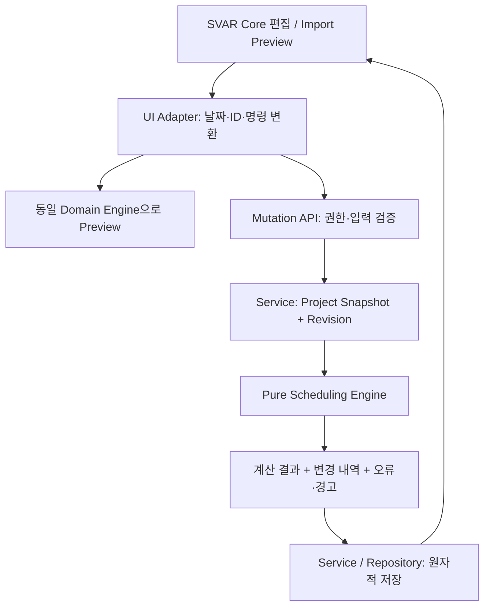

# Scheduling Engine 설계

## Issue #384 — 다중 root Copy와 계산 경계

Hierarchy service가 canonical numeric sibling preorder로 selected root를 정리하고 자손 union을 만든다. identity와 배치만 확장하며 Scheduling Domain algorithm은 #378을 재사용한다. copied leaf requestedStart/duration/mode 보존 → Project Calendar base schedule → 전체 graph와 복제 internal Link 재계산 → Summary 파생 → 원자적 commit 순서다. 여러 root 사이 내부 Dependency도 계산하고 외부 incoming/outgoing 관계는 생성하지 않는다.

빈 Summary는 구조와 미산정 null 일정을 보존한다. Milestone·FS/SS/FF/SF signed lag/lead·Manual conflict 정책은 유지한다. 복사본 Baseline은 기존 Task Copy대로 null 초기화하고 Summary는 파생한다. 실제 일정 재계산이 원본 Baseline을 이동시키지 않는다. Assignment 미지원·Task 상한·persistence 실패는 전체 Task/Link와 revision을 rollback한다. pure Domain은 authorization/clipboard/SVAR 선택을 참조하지 않으며 algorithm·DB schema/migration 변경은 없다.

## Issue #378 — Dependency가 포함된 subtree Copy 재계산

Subtree Copy는 저장된 effective start/end를 그대로 복제해 고정하지 않는다. 외부 Dependency를 제외한 복사본 그래프가 원본 그래프와 다를 수 있기 때문이다.

1. copied leaf의 `requestedStart`, duration, scheduleMode를 원본에서 보존한다.
2. Project Effective Calendar로 각 leaf의 base schedule을 재구성한다.
3. 새로 복제한 internal Dependency와 기존 프로젝트 전체 Dependency를 `recalculateDependencies()`에 적용한다.
4. Auto Task는 남은 lower bound에 맞춰 이동하고 Manual Task의 기존 conflict/graph validation을 유지한다.
5. leaf 확정 후 Summary 일정/진척/Baseline 파생을 기존 hierarchy engine으로 다시 계산한다.

외부 predecessor가 Copy 집합 밖이면 copied Task에는 그 제약을 생성하지 않으므로 Auto Task가 requestedStart 쪽으로 앞당겨질 수 있다. 이는 정상이며 effective date를 requestedStart로 오염시키지 않는다. FS/SS/FF/SF, signed lag/lead, Milestone duration 0, Summary endpoint 금지 계약은 그대로 유지한다.


상태: W06 Working Calendar/Duration과 W07 root Leaf/Milestone 저장 연결을 기반으로, Issue #57에서 Working Calendar를 `Base weekly rule + WORKING/NON_WORKING date exception`으로 일반화하고 Project Calendar Preview/저장 및 Resource Effective Calendar를 연결했다. Gregorian date-only, 근무일 연산과 Leaf/Summary 계산은 `src/domain/scheduling/`의 pure API를 유지한다. W24의 Summary/WBS 계층 계산을 유지하며 Issue #68에서 Calendar mutation 경로에 `FS/lag=0` Dependency forward-pass를 연결했다. 근거는 [W06_REVIEW.md](W06_REVIEW.md), [W07_REVIEW.md](W07_REVIEW.md), 외부 입력 계약은 [IMPORT_SCHEMA.md](IMPORT_SCHEMA.md)이다.

## 1. 범위와 결정 구분

**Confirmed**: `src/domain/scheduling/`에 UI·DB와 독립적인 계산 계층을 둔다. 초기 범위는 Project Working Calendar, 주말·휴일 제외, 근무일 Duration, Summary 계산, FS Dependency, 의존 관계 재계산, WBS다. Server가 최종 결과를 계산하며 Client Preview에서도 같은 Pure Domain Logic을 사용한다.

**구현 기준**: 일 단위 Gregorian 날짜, 양 끝 포함 구간, `Asia/Seoul` 표시 기준과 월~금 근무/토·일 휴무의 Base weekly rule을 사용한다. Issue #57부터 Project Calendar는 여러 국가 규칙과 Project Custom 휴무를 날짜 예외로 결합하며, 명시적 `WORKING/NON_WORKING` 예외가 기본 주간 규칙보다 우선한다. FS/lag=0 경계는 기존과 같다. 일반 업무의 Duration은 양의 정수 근무일이다. 업무는 `auto` 또는 `manual`이고 생략 시 `auto`로 정규화한다. 시각·반일·개별 업무 Calendar는 초기 범위에 없다.

**Manager 결정**: 입력 의도인 `requestedStart`와 계산 결과인 `start`를 분리한다. Summary를 Dependency Endpoint로 쓰지 않는다. Auto 일정의 비근무 시작일은 다음 근무일로 이동하고, Manual 일정의 비근무 시작일 또는 FS 위반은 전체 변경을 거부한다. Milestone을 포함한 모든 FS는 선행 종료일보다 뒤의 근무일에 후행 업무를 시작한다. 이는 본 시스템의 일 단위 규칙이며 다른 일정 도구와 동일한 의미라고 가정하지 않는다.

**Decision Required — 해당 확장 착수 시**: 시간 단위 Milestone 사건 의미, SS/FF/SF와 Lag/Lead, Summary Dependency, Manual 제약을 허용하는 경고 저장 정책, 여러 Calendar의 우선순위, Resource 용량·단위, CPM의 완료 목표일과 제약 모델. 초기 구현을 이 확장들의 결정까지 미루지 않는다.

## 2. 책임과 데이터 흐름


```mermaid
flowchart TD
  UI[SVAR Core 편집 / Import Preview] --> AD[UI Adapter: 날짜·ID·명령 변환]
  AD --> PRE[동일 Domain Engine으로 Preview]
  AD --> API[Mutation API: 권한·입력 검증]
  API --> SVC[Service: Project Snapshot + Revision]
  SVC --> ENG[Pure Scheduling Engine]
  ENG --> RES[계산 결과 + 변경 내역 + 오류·경고]
  RES --> TX[Service / Repository: 원자적 저장]
  TX --> UI
```

- Engine은 React, SVAR, SQLite, HTTP, Cookie, 파일·네트워크 I/O를 import하지 않는다. 현재 시각, 난수, 시스템 Timezone에 따라 결과가 달라져서도 안 된다.
- Service가 Project에 한정된 Task·Dependency·Calendar의 완전한 Snapshot을 읽는다. Engine은 인증·DB Transaction을 직접 수행하지 않는다.
- UI는 SVAR 공식 렌더러·편집 이벤트를 사용한다. 화면 이벤트를 Domain 입력으로 바꾸는 Adapter와 계산 계층을 분리한다. Core가 표시 가능한 기능과 본 시스템에서 저장 가능한 일정 제약은 서로 다른 계약이다.
- Client Preview는 참고 결과다. Server는 최신 Snapshot과 Calendar로 재검증·재계산하고 전체 변경을 Transaction으로 저장한다. Preview 이후 Revision이 달라졌으면 충돌 응답 후 다시 Preview한다. 정확한 HTTP 계약은 [API.md](API.md)에서 관리한다.
- Server 결과로 화면을 갱신한다. 낙관적 화면 변경이 거부되면 마지막 확정 Snapshot으로 복원하고 원인을 표시한다. 여러 SVAR 이벤트가 하나의 이동을 표현하더라도 Domain 변경을 중복 저장하지 않도록 Adapter에서 논리적 명령을 구성한다.

## 3. Domain 입력·출력 개념

아래는 설계용 개념이며 TypeScript 구현이나 별도 Import Schema가 아니다. Import의 필수 여부·JSON 형태와 호환성은 [IMPORT_SCHEMA.md](IMPORT_SCHEMA.md)가 우선한다.

| 개념 | 의미와 불변 조건 |
| --- | --- |
| Task 식별 | Snapshot 내부의 안정적인 문자열 키. Import `externalId`를 Service가 대응한다. Project 밖의 ID는 허용하지 않는다. 행 번호·WBS를 참조 키로 쓰지 않는다. |
| `type` | `task`, `summary`, `milestone`만 허용한다. |
| `requestedStart` | 사용자가 요청한 시작일. Import·Mutation 입력의 `start`가 이 값으로 정규화된다. 저장하여 재계산 때 재사용한다. |
| `start`, `end` | Calendar와 Dependency 적용 후 확정되는 계산 날짜. API 조회 결과는 `requestedStart`와 구별하여 제공한다. 일정 있는 Leaf 자손이 없는 Summary는 둘 다 `null`이다. |
| `duration` | Task는 정수 `>=1`, Milestone은 `0`, Summary는 하위 일정으로 계산한다. 집계 대상 Leaf가 없으면 `null`이다. |
| `scheduleMode` | Leaf의 `auto` 또는 `manual`. Summary는 항상 파생 계산 대상이다. |
| `progress` | Leaf는 유한 숫자 `0..100`. Summary는 하위 Leaf에서 계산하며 대상이 없으면 `null`이다. `null`은 0%/100% 완료가 아니다. |
| Parent·Sibling Order | Parent 참조와 저장된 형제 순서. Import 배열에서 같은 Parent의 등장 순서로 초기 순서를 만든다. |
| Dependency | 선행 Leaf → 후행 Leaf 방향. 초기 유효 값은 FS, lag=0. |
| Calendar | Base weekly rule + 날짜별 `NON_WORKING/WORKING` 예외. Project 일정에는 Project target rule만 사용하고 Resource workload에는 Project < Group < Resource 순서로 명시적 WORKING/NON_WORKING 예외를 적용한다. |
| Result | 새 Snapshot, 원본 대비 변경 Task, 날짜 이동 이유, 경고, 안정적인 오류 코드와 관련 Task ID. 실패하면 저장 가능한 부분 결과를 반환하지 않는다. |

`requestedStart`를 계산된 `start`로 자동 덮어쓰지 않는다. 예를 들어 B의 요청일이 9월 14일이고 A 때문에 9월 17일로 밀렸다면, A가 앞당겨졌을 때 B는 원래 요청일을 기준으로 다시 계산한다. 화면에서 사용자가 직접 시작일을 변경하는 명령만 새로운 요청일을 만든다. 별도 날짜 고정이 필요하면 `manual`을 사용한다.

## 4. Date-only와 Calendar

### 날짜 표현

입출력은 정확한 `YYYY-MM-DD` 문자열을 사용한다. 정규식뿐 아니라 Gregorian 윤년·월별 일수로 실제 날짜를 검증한다. `2026-02-30`, Timezone 접미사·시각이 붙은 값, 모호한 지역 날짜 문자열은 거부한다. 내부 연산은 검증된 연·월·일 또는 정수 Day Ordinal로 한다.

Local 자정 Timestamp 차이를 `86,400,000`으로 나누어 일수를 계산하지 않는다. DST가 있는 실행 환경에서도 하루를 Gregorian 날짜 하나로 센다. Browser `Date` 객체는 SVAR Adapter 경계에서만 생성·해석하고 `toISOString().slice(0, 10)`에 의존해 Local 날짜를 변환하지 않는다. Server의 저장·계산은 Browser 및 Container Timezone과 무관해야 한다.

`Asia/Seoul`은 Project의 표시·업무 날짜 기준이다. 문자열 `2026-09-11` 자체를 UTC Instant로 바꾸는 규칙이 아니다. W06 Domain 지원 범위는 [API.md](API.md)의 초기 상한과 같은 `1900-01-01..2199-12-31`이며 전체 109,573일을 절대 탐색 상한으로 사용한다. 일반 Task duration은 정수 `1..10000`이다. 날짜 또는 계산 결과가 범위를 벗어나면 구조화된 오류로 종료한다.

### Calendar 연산 계약

| 개념 연산 | 정의 |
| --- | --- |
| `isWorkingDay(d)` | 명시적 날짜 예외가 있으면 그 `dayType`을 사용하고, 없으면 월~금 true / 토·일 false |
| `nextWorkingDay(d, inclusive)` | `inclusive=true`이면 d부터, false이면 d 다음 날짜부터 첫 근무일 탐색 |
| `workingDaysBetween(s, e)` | s≤e인 구간의 양 끝을 포함하여 Effective Calendar의 근무일 수 계산 |
| `endFromStart(s, n)` | 근무일 s를 첫날로 하여 n번째 Effective 근무일 반환. Task는 n≥1 |

`NON_WORKING`은 평일도 휴무로 만들고 `WORKING`은 기본 주말도 근무일로 만든다. 날짜별 명시 예외가 Base weekly rule보다 우선한다. 기존 `holidays` 입력은 하위 호환을 위해 모두 `NON_WORKING` exception으로 정규화한다. 동일 Calendar input에서 같은 날짜가 중복되거나 서로 충돌하면 암묵적으로 선택하지 않고 오류로 거부한다. 국가 데이터 생성·출처 선택은 Scheduling Domain 밖의 서버 Calendar 계층이 담당하며 Engine은 정규화된 exception만 입력받는다. 성공한 Calendar는 날짜순 고유 목록을 복사·동결한다. 전체 범위가 비근무일이어도 최대 지원 범위 안에서 종료하고 근무일을 찾지 못했다는 오류를 반환한다.

### W06 공개 Domain API

`src/domain/scheduling/index.ts`는 다음 pure API와 상한을 공개한다.

- `parseDateOnly`, ordinal 변환·가감·요일: strict Gregorian label과 범위 검사
- `createWorkingCalendar`: exact `Asia/Seoul`, exact weekend `[6,0]`, legacy Holiday 및 `WORKING/NON_WORKING` exception 검증·정렬·불변 복사
- `isWorkingDay`, `nextWorkingDay`, `workingDaysBetween`, `endFromStart`: 양 끝 포함 근무일 연산
- `scheduleLeaf`: `requestedStart` 보존, Auto 비근무 시작 이동 warning, Manual 거부, Task/Milestone와 dependency 전 optional end 검증
- `recalculateFinishStartDependencies`: calendar-normalized Leaf와 FS/lag=0 graph를 검증하고 Kahn forward-pass로 Auto 일정 이동 및 Manual lower-bound conflict를 계산
- `SchedulingError`: 안정적인 `code`와 제한된 `field/date/expectedDate/index` context
- `MIN_SUPPORTED_DATE`, `MAX_SUPPORTED_DATE`, `MAX_CALENDAR_SPAN_DAYS`, `MAX_TASK_DURATION`, `MAX_CALENDAR_HOLIDAYS`, `MAX_CALENDAR_EXCEPTIONS`: 실행 가능한 자원 경계

구현은 자체 Gregorian ordinal을 사용하며 `Date`, `Date.parse`, `Intl`, system timezone, 현재 시각, React, SVAR, DB, HTTP 또는 I/O를 import하지 않는다. Calendar 조회는 날짜 방문 수 `D`와 정렬 Holiday의 이진 검색 `O(log H)`를 사용하며 `D≤109573`이다.

## 5. Leaf Duration과 입력 검증 순서

일반 Task는 `requestedStart + duration`을 기준으로 한다. Milestone은 `duration=0`, 계산된 `start=end`다. Duration이 0인 일반 Task를 Milestone으로 조용히 변환하지 않는다. Progress 100이라고 날짜·Duration을 줄이지 않는다.

Issue #368의 Task Editor는 입력 편의를 위해 UI draft `requestedEnd`를 보여 줄 수 있다. 이 값은 저장/Domain source가 아니며 Project canonical Calendar로 `endFromStart(normalizedRequestedStart, duration)`에서 도출한다. 사용자가 요청 종료일을 직접 입력한 경우 같은 Calendar의 `workingDaysBetween(normalizedRequestedStart, requestedEnd)`으로 duration을 역산한 뒤 기존 `requestedStart + duration` command만 서버에 보낸다. 요청 종료일이 비근무일이거나 시작일보다 빠르면 client field validation으로 저장을 막지만, 최종 Calendar/Dependency/Manual 검증과 canonical `start/end` authority는 계속 서버다.

아래 순서는 hierarchy와 dependency를 포함한 전체 Engine의 목표 순서다. W06 `scheduleLeaf`는 date/type/duration/mode/optional end만 입력받으며 progress, hierarchy와 dependency 검증은 W07–W09에서 이 순서에 연결한다.

1. 입력 날짜, Type, Duration, Progress를 검증한다.
2. Auto의 비근무 요청일은 다음 근무일로 정규화하고 `NON_WORKING_START_SHIFTED` 경고를 만든다. Manual은 `NON_WORKING_MANUAL_START` 오류다.
3. 정규화한 요청 시작일과 Duration으로 **Dependency 적용 전 종료일**을 계산한다. Milestone은 이 시작일이 종료일이다.
4. 입력 `end`가 함께 제공되었다면 3번 결과와 정확히 같아야 한다. 다르면 `END_DURATION_MISMATCH`로 거부한다. end-only 입력이나 duration 역산의 허용 여부는 Import 계약에 따른다. 표준 Domain 입력에 모호한 두 기준을 남기지 않는다.
5. Dependency를 적용하여 최종 `start/end`를 구한다. 이 단계의 이동은 Preview 변경 내역이다. 이를 4번의 입력 불일치로 다시 판정하지 않는다.

Resize는 Adapter가 사용자가 선택한 구간을 근무일 Duration으로 정규화하는 명시적 명령이다. Engine이 화면의 Calendar-day Duration을 근무일 Duration으로 오인하지 않도록 한다. Summary 바를 직접 Resize하거나 Drag하여 자식 날짜를 암묵적으로 바꾸는 기능은 초기 범위에 없다.

## 6. Parent Tree, Summary와 WBS

Parent Tree와 Dependency Graph는 별개로 검증한다. 최종 Snapshot의 Parent는 같은 Project에 존재하는 `summary`만 가능하다. 자기 Parent, Missing Parent, Parent Cycle을 거부한다. 일반 Task와 Milestone은 자식을 갖지 않는다. 잘못된 Type을 Engine에서 자동 변환하지 않는다. W24의 첫 하위 작업 추가는 UI 확인과 명시적 `convertParentToSummary: true` 명령을 받은 Service가 기존 일반 Task를 Summary로 바꾸고 자식을 함께 생성하는 원자적 변경이다. Milestone은 Parent로 전환하지 않는다.

Issue #345부터 Summary는 자식이 없어도 유효한 WBS 컨테이너다. 직접 자식이 없는 Summary와, 자식이 모두 일정 미산정 Summary인 상위 Summary 모두 `type: summary`를 유지한다. 첫 Leaf 추가 시 일정이 산정되고 마지막 Leaf 삭제/이동 시 미산정 상태로 돌아간다. 부모를 자동 삭제하거나 일반 Task로 전환하지 않는다. Summary 자체 삭제와 명시적 subtree 삭제는 [API](API.md)의 범위 확인·권한·revision 계약을 따른다. W24/#31/#344의 과거 빈 Summary 거부 정책은 이 정의가 대체하며 실패 복구 정합성 계약은 유지한다.

하위에서 상위 순서로 다음 값을 계산한다.

- `start`: 모든 하위 Leaf의 최소 시작일.
- `end`: 모든 하위 Leaf의 최대 종료일.
- `duration`: 위 구간의 근무일 수. 자식 Duration의 합이 아니다. Milestone만 같은 날짜에 있는 Summary도 구간 표현이므로 근무일 Span은 1이다.
- `progress`: 하위 일반 Task의 `sum(duration × progress) / sum(duration)`. 중첩 Summary의 Span을 가중치로 다시 더하지 않는다. Milestone은 Duration 0이므로 이 가중합에서 제외한다. 일반 Task가 전혀 없는 Summary는 하위 Milestone Progress의 산술 평균으로 계산한다. 계산 중간 값을 반올림하지 않고 표시 정밀도만 UI에서 처리한다.

집계할 Task/Milestone Leaf가 0개이면 `requestedStart/start/end/duration/progress`는 모두 `null`, `scheduleMode`는 `auto`다. 빈 Summary는 상위 min/max, 진척 가중합과 평균의 분모에 기여하지 않는다. 날짜가 있는 Milestone은 기간이 0이어도 Leaf 1개로 센다. 전체가 Summary인 트리는 날짜 min/max나 근무일 Span을 호출하지 않고 WBS만 계산한다. 오늘·프로젝트 시작일·이전 자식 날짜·기간 0/1을 대체값으로 저장하지 않는다.

Summary Baseline도 실제 Leaf에서 파생한다. 빈 Summary는 Baseline 완비성 검사의 중립 요소이며 실제 Leaf 중 하나라도 Baseline이 없으면 기존 규칙대로 상위 파생 Baseline은 `null`이다. 실제 Leaf가 0개이면 파생 `baselineStart/baselineEnd/baselineDuration`은 모두 `null`이다. 실제 Leaf Baseline은 재계산으로 변경하지 않는다.

Summary 입력 날짜·Duration·Progress를 최종 계산에 사용하지 않는다. Import에서 제공되었다면 원본과 파생 결과의 차이를 Preview로 알리는 방식은 [IMPORT_SCHEMA.md](IMPORT_SCHEMA.md)에 따른다. 자식 일정·진척·Parent 변경과 삭제 후 모든 조상 Summary를 다시 계산한다. 필터로 숨긴 자식도 계산에 포함한다.

WBS는 Parent Tree의 형제 순서에 따라 `1`, `1.1`, `1.2`, `2` 형태로 계산한다. Root도 저장된 순서를 따른다. 화면 정렬·필터는 저장 순서를 바꾸지 않는다. 명시적 Reorder·Reparent 후 WBS를 다시 계산한다. 배열에서 자식이 Parent보다 먼저 나와도 모든 ID를 먼저 등록하여 처리한다. WBS가 달라져도 External ID와 Dependency 참조는 유지된다.

### W24 공개 계층 API와 계산 경계

`recalculateHierarchy(tasks, calendar)`는 canonical Leaf 일정과 변경 후 전체 Project Task Snapshot을 받아 Summary와 WBS를 계산한다. 입력 필드는 `taskId`, `externalId`, `parentExternalId`, `siblingOrder`, `type`, `requestedStart`, `start`, `end`, `duration`, `progress`, `scheduleMode`다. Summary의 미산정 상태를 위해 일정 필드의 TypeScript 입력은 nullable이며 Leaf 날짜·기간·진척의 runtime 필수 검증은 그대로 유지한다. 결과 타입 `HierarchyTaskResult<T>`는 일정 필드를 nullable로 명시하므로 이전 일정이 있던 Summary도 `null`이 될 수 있음을 호출자에게 전달한다. 다른 DTO 필드를 보존하며 입력 배열 순서를 유지한 새 동결 배열과 새 동결 Task 객체를 반환한다. WBS는 Domain 결과에 포함하지만 W24 HTTP DTO에 새 필드를 요구하지 않는다.

- Service는 변경 Leaf를 `scheduleLeaf`로 먼저 계산하고 명시적인 Task→Summary 전환을 완료한 Snapshot을 전달한다. Engine은 Parent/Type을 바꾸지 않고 Leaf를 다시 스케줄하지 않는다.
- Summary의 기존 날짜·기간·진척·모드는 계산에 사용하지 않는다. 결과는 하위 Leaf만을 집계하며 `scheduleMode: auto`, `requestedStart: null`이다. 중첩 Summary의 중간 진척률을 반올림하거나 Span을 가중치로 중복 집계하지 않는다.
- Leaf 시작/종료 날짜는 유효한 근무일이어야 하며 기간과 양 끝 포함 근무일 수가 일치해야 한다. Milestone은 기간 0, 시작=종료다. Leaf Progress는 유한한 `0..100`이다. 자동/수동 요청 시작일의 실제 스케줄 정규화는 앞 단계 `scheduleLeaf`의 책임이다.
- ID와 External ID는 각각 유일하고 Parent는 Snapshot 안의 Summary여야 한다. 형제 순서는 0 이상 Safe Integer이고 같은 Parent 안에서 중복할 수 없다. 삭제로 생긴 번호 간격은 허용하며 WBS 표시 번호는 형제 정렬 순서로 다시 계산한다.
- 상한은 기존 API 기준으로 `MAX_HIERARCHY_TASKS=5000`, `MAX_HIERARCHY_DEPTH=64`(Root 깊이 1)다. 배열이 비었거나 Summary들로만 구성되어도 유효하다. 순환·부모 누락·상한 초과는 `SchedulingError`로 전체 실패한다. 부분 결과는 반환하지 않는다.
- ID Map과 Root-first 반복 순회로 Parent Graph를 검증한다. 방문하지 못한 노드가 있으면 Parent Cycle이며 잔여 모든 노드를 실제 Cycle 경로라고 과대 표시하지 않는다. 역순 순회로 조상 집계를 수행해 JavaScript 재귀 Stack에 의존하지 않는다.
- Leaf 전체 날짜 Span에 근무일 Prefix Count를 한 번 작성한다. Calendar Span은 기존 날짜 범위 안의 최대 109,573일이며 Summary Span/Leaf 기간 검증은 Prefix 조회로 처리한다. Leaf가 없으면 Span 탐색을 하지 않고 최소 Prefix 저장소만 생성한다. 역순 집계에서 `leafCount=0`인 자식은 일정/Baseline에 기여하지 않는다. 형제 정렬을 포함한 비용은 `O(N log N + D log(H+1) + W)`, 메모리는 `O(N + D + W)`다. N은 Task 수, D는 전체 날짜 Span(Leaf가 없으면 0), H는 Holiday 수, W는 WBS 문자열 총 길이다. Calendar Prefix를 제외한 알고리즘만 O(N)이라고 전체 성능을 표시하지 않는다.

`tests/domain/scheduling/hierarchy.test.ts`는 중첩 집계, 비정수 진척, 순수 Milestone 평균, 주말·휴일 경계, 자식 갱신·삭제 후 조상 재계산, WBS와 비연속 입력 순서, 순환/부모 누락/잘못된 Type, 형제 중복, 날짜·기간·진척 검증, 깊이·노드 상한 및 입력 불변/멱등성을 검증한다. `empty-summary.test.ts`는 빈 루트/중첩 Summary, 실제 Leaf와 빈 분기의 진척/Baseline 혼합, 첫/마지막 Leaf 추가·삭제·이동, 전체 미산정 트리 상한 및 nullable Leaf 거부를 검증한다. 계층 함수는 Reparent 명령이나 Leaf 재스케줄을 직접 수행하지 않고 변경 후 Snapshot을 계산한다. API 권한·Revision·원자적 저장은 Service 통합 테스트에서 별도로 검증한다.

## 7. 의존성 관계(Dependency)와 Lag 계산 규칙

지원되는 Endpoint는 일반 Task 또는 Milestone이다. Missing Target, 자기 연결, 동일 선행-후행 중복 연결, Project 밖 참조, Summary Endpoint, Cycle은 거부한다.

### 4대 의존성 관계 종류 및 Lag 공식

선행 작업 A와 후행 작업 B(기간 $D_B$, 0인 경우 마일스톤) 및 정수 Lag(근무일수 단위, 음수 가능)에 대해, B의 시작 가능 하한선(`requiredStart`)은 다음과 같이 결정된다:

1. **FS (Finish-to-Start, 종료 후 시작)**
   - 기준: $A$의 종료일 다음 첫 근무일로부터 $Lag$ 근무일 오프셋 이동.
   - $requiredStart = \text{shiftWorkingDate}(\text{nextWorkingDay}(A.end, \text{false}), Lag)$
2. **SS (Start-to-Start, 시작 후 시작)**
   - 기준: $A$의 시작일로부터 $Lag$ 근무일 오프셋 이동.
   - $requiredStart = \text{shiftWorkingDate}(A.start, Lag)$
3. **FF (Finish-to-End, 종료 후 종료)**
   - 기준: $A$의 종료일로부터 $Lag$ 근무일 오프셋 이동한 날짜가 후행 작업의 최소 종료일($requiredEnd$)이 됨.
   - $requiredEnd = \text{shiftWorkingDate}(A.end, Lag)$
   - $requiredStart = \text{startFromEnd}(requiredEnd, D_B)$ ($D_B \ge 1$인 경우 $D_B$ 근무일 역산, 마일스톤은 $requiredEnd$ 자체)
4. **SF (Start-to-End, 시작 후 종료)**
   - 기준: $A$의 시작일로부터 $Lag$ 근무일 오프셋 이동한 날짜가 후행 작업의 최소 종료일($requiredEnd$)이 됨.
   - $requiredEnd = \text{shiftWorkingDate}(A.start, Lag)$
   - $requiredStart = \text{startFromEnd}(requiredEnd, D_B)$

### 복수 선행 작업 및 스케줄 확정

- $lowerBound(B) = \max_{A \to B} \{ requiredStart(B, A) \}$
- 선행 작업이 없는 경우 $lowerBound(B) = \text{Calendar로 정규화한 } B.requestedStart$
- **Auto Task**:
  - $B.start = \max(\text{정규화된 } B.requestedStart, lowerBound(B))$
  - $B.end = \text{endFromStart}(B.start, D_B)$ (재계산)
- **Manual Task**:
  - 요청 날짜·Duration으로 고정된 구간을 검증한다.
  - $B.start < lowerBound(B)$이면 `MANUAL_DEPENDENCY_CONFLICT` 오류로 전체 변경을 거부한다.
- 선행 변경, Dependency 추가·수정·삭제, Duration·Calendar 변경 시 전체 DAG에 대해 위상 정렬 순서로 이 규칙을 재적용한다.

## 8. 재계산 절차와 복잡도

초기 구현은 작은 Project에 대해 전체 Snapshot을 결정적으로 재계산한다. 증분 계산 최적화는 측정 후 검토한다.

1. 입력을 복사·정규화하고 ID Map을 구성한다. 중복 ID·필드 오류를 수집한다.
2. Parent 참조·Type·Cycle을 검증하고 Children Map을 만든다. 깊은 트리는 반복형 순회로 처리한다.
3. Leaf 입력을 Calendar 기준으로 정규화하고 제공된 종료일을 검증한다.
4. Dependency의 Endpoint와 지원 Type을 검증하고 인접 목록·진입 차수를 만든다.
5. Kahn 위상 정렬로 Dependency DAG를 검증한다. 처리한 Leaf 수가 전체보다 작으면 Cycle 오류다. 잔여 노드 전체를 실제 Cycle 경로라고 보고하지 말고, 추가 DFS 등으로 실제 경로 또는 SCC를 추출하여 진단한다.
6. 위상 순서대로 선행 Bound를 합산하고 Auto 이동 또는 Manual 충돌을 계산한다. 같은 우선순위는 Snapshot의 안정적 순서로 처리한다.
7. Parent Tree를 후위 순회하여 Summary 값을 계산하고 전위 순회로 WBS를 부여한다.
8. 원본과 비교한 변경 내역과 이동 이유를 반환한다. Service가 Revision 확인 후 전체 변경을 원자적으로 저장한다.

Task 수 N, Dependency 수 E, Holiday 수 H일 때 ID·그래프 검증과 위상 정렬은 O(N+E), 저장 공간은 O(N+E+H)다. Calendar 비용은 별도다. 단순 날짜 순회라면 총 방문 날짜 수를 C라 할 때 전체 비용은 O(N+E+H+C)다. Span D에 대한 Calendar Prefix Count를 도입하면 전처리 O(D+H)와 메모리 O(D)가 추가되므로 그래프 계산만의 O(N+E)를 전체 성능으로 제시하지 않는다. WBS 문자열 생성 비용도 결과 문자열 총 길이에 비례한다.

입력 크기·기간·깊이 상한, 날짜 Overflow 검사, Cycle 조기 실패를 검증한다. 벤치마크 없이 SVAR의 렌더링 Task 수를 이 Engine의 처리 성능으로 인용하지 않는다.

## 9. 계산 예시

모든 예시는 토·일 휴무다. `2026-09-14`를 휴일로 지정한 예시는 **테스트용 조직 휴일**이며 실제 법정 공휴일이라는 뜻이 아니다.

| 상황 | 입력 | 기대 결과 |
| --- | --- | --- |
| 양 끝 포함 | 9/11(금), Task 1일, 휴일 없음 | start=end=9/11 |
| 주말 경계 | 9/11(금), Task 2일, 휴일 없음 | end=9/14(월) |
| 휴일 경계 | 9/11(금), Task 2일, 9/14 휴일 | end=9/15(화) |
| Auto 비근무 시작 | 요청 9/12(토), 1일, 휴일 없음 | start=end=9/14, 이동 경고 |
| Manual 비근무 시작 | 요청 9/12(토), 1일 | 전체 변경 거부 |
| FS와 휴일 | A.end=9/11, B 요청 9/11·2일, 9/14 휴일 | B.start=9/15, B.end=9/16 |
| 입력 end 검증 시점 | 위 B에 입력 end=9/15 | Calendar 기준 9/11+2일과 일치하여 유효; FS로 최종 9/16 이동 |
| 입력 불일치 | 위 B에 입력 end=9/16 | Dependency 전 종료일 9/15와 불일치하여 거부 |
| 여러 선행 | A.end=9/11, C.end=9/15, B 요청 9/11·1일 | B.start=end=9/16 |
| Manual FS 충돌 | A.end=9/15, Manual B.start=9/15 | 전체 변경 거부 |
| Milestone FS | M.start=end=9/11·0일, M→B, 휴일 없음 | B의 가장 빠른 시작은 9/14 |
| Milestone 연쇄 | M1=9/11, M1→M2, 휴일 없음 | M2.start=end=9/14, Duration 0 유지 |
| Summary Span·진척 | A=9/11·1일·100%, B=9/15~16·2일·0%, 휴일 없음 | Summary 9/11~16, 4근무일, Progress 100/3% |
| 순수 Milestone Summary | 같은 날짜 Milestone 2개, Progress 0%와 100% | Span 1근무일, Progress 50% |

## 10. 구현 시 필수 검증

W06 범위인 날짜·Calendar·Leaf Duration·Milestone·단일 Leaf Manual 시작과 runtime 결정성은 **PASS**다. W07에서는 지원 범위인 root Leaf/Milestone 저장의 권한·Project 격리·Revision 충돌·Rollback·재조회 일치까지 **PASS**했다. W24의 Pure Parent Graph/Cycle/Summary/WBS와 계층 입력 불변·상한은 Domain Unit Test로 검증한다. 아래 표는 전체 Scheduling Engine의 최종 검증 목표이며 Dependency 기반 재계산·저장, Reparent와 Calendar 변경은 아직 후속 범위다. W06 자동화 증거는 [W06_REVIEW.md](W06_REVIEW.md), W07 저장 증거는 [W07_REVIEW.md](W07_REVIEW.md)에 기록한다.

| 영역 | 필수 검증 |
| --- | --- |
| 날짜 | 윤년 2028-02-29 허용, 2026-02-29 거부, 월말·연말, 날짜 범위 Overflow, 시각 포함 문자열 거부 |
| Calendar | 주말, 연속 Holiday, 주말과 Holiday 중복, 비근무 시작 Auto/Manual, 탐색 상한 |
| Duration | 1일, 장기 기간, 0/음수/소수 Task 거부, Milestone 0일, end 불일치, Dependency 전 검증 순서 |
| Graph | 단일 FS, 여러 선행, 분기·합류, 자기 연결, 중복 연결, Missing Target, Summary Endpoint, SS/FF/SF/Lag/Lead 거부 |
| Cycle | Parent Cycle과 Dependency Cycle 각각, Manual을 통과하는 Cycle, Cycle 뒤에 붙은 비순환 노드를 오진하지 않는 오류 경로 |
| Summary | 중첩, 자식 이동·삭제·Reparent, 숨긴 자식 포함, 가중 진척, Milestone-only, Empty Summary의 null 일정·진척/Baseline과 WBS 유지 |
| WBS | 비연속 Import 배열, Parent 뒤에 나온 자식·앞에 나온 자식, Reorder, Reparent, UI Sort/Filter로 불변 |
| 재계산 | 선행을 뒤·앞으로 이동, 연결 삭제로 복귀, Calendar 변경, 동일 입력의 동일 결과, 재계산 멱등성 |
| Mixed Mode | Manual 유지, Manual 선행→Auto 후행, Auto 선행→Manual 충돌, Calendar만 변경 시 Manual 종료 이동 거부, 명시적 Manual 수정, 전체 실패 시 원본 Snapshot 불변 |
| 경계 통합 | Server/Browser 동일 Fixture 결과, UTC·Asia/Seoul·DST Timezone에서 Date-only 왕복, SVAR inclusive/exclusive End Adapter |
| 저장 | 권한 없는 호출 거부, Project 격리, Revision 충돌, 오류 시 전체 Rollback, 저장 후 재조회·Preview 결과 일치 |

성질 기반 검증 후보: 유효 일반 Task의 `workingDaysBetween(start,end)=duration`, 모든 Leaf Endpoint가 근무일, 모든 FS Bound 만족, Summary가 하위 Leaf를 포함, 원본 입력 불변, 계산 결과를 같은 요청값으로 재계산해도 날짜가 더 밀리지 않음.

## 11. 향후 확장 경계

SS/FF/SF와 Lag/Lead는 Constraint 모델을 먼저 정의하고 Formula·Cycle·Calendar 단위 검증을 추가한다. Baseline은 별도 불변 Snapshot으로 보관하여 현재 일정 재계산이 수정하지 않도록 한다. CPM은 Forward/Backward Pass와 목표 완료 경계, Total Slack·Free Slack의 근무일 정의를 확정한 후 구현한다. Manual 날짜 제약이 있는 네트워크에서 잘못된 Critical 표시를 내지 않는 것이 우선이다.

Grouping은 표시 그룹과 실제 Parent Tree를 구분한다. Resource Assignment·Workload·Calendar는 단위·용량·겹침·다중 Calendar 충돌 정책이 필요하다. Rollup은 표시 집계와 Summary 계산을 구분하고, Split Task는 Segment 목록과 Duration·Dependency Endpoint의 의미를 별도 계약으로 확장한다. 이들은 초기 FS 모델의 숨은 옵션으로 구현하지 않는다.

관련 범위와 공식 기능 근거는 [PRO_FEATURE_MATRIX.md](PRO_FEATURE_MATRIX.md), 저장 책임은 [ARCHITECTURE.md](ARCHITECTURE.md)와 [DB_SCHEMA.md](DB_SCHEMA.md)에 연결한다.


## Issue #57 Calendar Resolution과 저장 경계

### Project Effective Calendar

```text
월~금 근무 / 토·일 휴무
+ Project COUNTRY rules의 materialized WORKING/NON_WORKING
+ Project CUSTOM NON_WORKING
= Project Effective Calendar
```

여러 국가 rule이 같은 날짜에 같은 day type을 만들면 계산에서는 한 번만 적용하고 source는 API Preview에 모두 보존한다. 서로 반대 day type이면 `CALENDAR_EXCEPTION_CONFLICT`로 저장 전에 거부한다. 국가 fixture는 현재 2026년 KR/CN/VN/PH/TH/MX/US만 검증 범위이며 범위 밖 연도는 추정하지 않는다.

### Resource Effective Calendar (#261)

```text
Project Effective Calendar
→ Resource가 속한 모든 Resource Group CUSTOM WORKING/NON_WORKING
→ Resource 개인 CUSTOM WORKING/NON_WORKING
= Resource Effective Calendar
```

`src/domain/scheduling/resource-calendar.ts`의 pure `resolveResourceCalendar`는 Project WorkingCalendar, Resource ID, 소속 Group ID 목록과 materialized explicit exception을 받는다. `Project < Group < Resource` 순서로 더 구체적인 명시 예외가 상위 결과를 뒤집는다. Group WORKING은 Project 휴일/주말을 근무일로 만들고, Resource WORKING은 Group 휴무를 되돌린다. 반대로 Resource NON_WORKING은 Group WORKING보다 우선한다. Project CUSTOM은 계속 NON_WORKING만 지원한다.

같은 날짜·같은 level의 동일 dayType은 계산에서 한 번만 적용하고 모든 Rule/Target source를 결정적으로 정렬하여 보존한다. 반대 dayType은 `ResourceCalendarExceptionConflictError` (`RESOURCE_CALENDAR_EXCEPTION_CONFLICT`)로 거부하며 context에는 `date`, `layer`, `resourceId`, `groupIds`, `ruleIds`, `sources`가 포함된다. Group level을 검증한 후 Resource를 적용하므로 Resource override로 Group 충돌을 숨길 수 없다. 입력 예외/그룹/DB 행 순서는 승자를 결정하지 않는다.

결과 `effects`는 날짜·layer별 `beforeDayType`, `dayType`, `CHANGED | NO_EFFECT`, sources 및 최종 `finalDayType`, `winningLayer`, `winningSources`를 반환한다. NO_EFFECT는 해당 layer 직전 상위 effective 상태와 같다는 뜻이며 저장 가능한 의도 명시다. 더 구체적인 Resource에 가려진 Group 효과도 최종 winner와 구분한다. Preview는 candidate 예외로, membership mutation은 candidate 소속 Group 목록으로 같은 resolver를 재사용한다. 저장 전에 모든 Resource(비활성/미할당 포함)와 빈 Group의 자체 충돌도 검증하며 충돌 시 mutation 전체를 rollback한다.

서버 `loadResourceCalendarExceptions`는 저장 Rule/Date를 pure 입력으로 변환하고 `resolveResourceWorkingCalendar`는 workload용 최종 WorkingCalendar를 제공한다. Group/Resource 예외는 #56 M/D, M/M 분자와 일별 allocation/과투입 판정에만 사용한다. Project Task start/end/duration 및 Manual/Dependency/Summary 재계산은 기존 Project Calendar만 사용하며 Resource Leveling으로 확장하지 않는다.

`tests/domain/scheduling/resource-calendar.test.ts`는 계층 override, NO_EFFECT, 중복 source 보존, 순서 독립, Group 충돌 은폐 방지, Resource 자체 충돌, membership 후보, 주말/윤일과 입력 불변을 검증한다. `tests/server/calendars/calendar-resolution.test.ts`는 SQLite adapter, Project 격리 및 기존 Project conflict 보존을 검증한다. API 저장·membership 원자성·workload는 별도 서비스 테스트로 검증한다.

### Calendar Preview / Commit

Calendar 후보를 변경할 때 Server가 최신 Project snapshot과 candidate calendar로 Leaf를 다시 계산한다. Auto task는 `requestedStart`와 duration을 보존하고 새 근무일 규칙으로 effective start/end를 계산한다. Manual task가 새 Calendar에서 동일 확정 interval을 유지할 수 없으면 `MANUAL_TASK_CALENDAR_CONFLICT`로 전체 저장을 거부한다. Summary는 변경된 leaf 결과에서 재집계한다.

Issue #68부터 persisted `FS/lag=0` Dependency가 있는 Project도 Calendar 일괄 변경을 지원한다. 계산 순서는 **현재/후보 Calendar base 비교 → 후보 Calendar Leaf 계산 → FS DAG forward-pass → Summary 재집계**다. 따라서 기존 dependency로 이미 늦춰진 후행 Task를 Calendar 이동으로 오진하지 않는다. Auto 후행의 FS 이동은 `DEPENDENCY` 원인과 실제 lower bound를 만든 선행 External ID를 Preview에 남긴다. Manual Task가 후보 Calendar 자체를 만족하지 못하면 `MANUAL_TASK_CALENDAR_CONFLICT`, Calendar 적용 후 FS lower bound를 위반하면 `MANUAL_DEPENDENCY_CONFLICT`로 저장 전체를 거부한다. Cycle은 `DEPENDENCY_CYCLE`, 지원 범위 밖 endpoint/관계는 `UNSUPPORTED_SCHEDULE_STRUCTURE`로 실패한다.

Preview는 DB를 변경하지 않으며 edit session, Origin, If-Match를 검증한다. Commit은 Calendar rule/date 교체, Auto/Summary 일정 저장, revision +1을 하나의 SQLite transaction에서 수행한다.

## Issue #72 hierarchy mutation integration

Grid DnD와 Context Menu의 reorder/reparent/copy는 Scheduling Domain의 날짜 계산 규칙을 새로 정의하지 않는다. 서버 서비스가 먼저 현재 persisted hierarchy를 검증한 뒤 parent와 sibling order를 원자적으로 변경하고, 동일 transaction에서 `recalculateHierarchy`로 모든 영향 Summary의 start/end/duration/progress를 다시 파생한다. Leaf의 `requestedStart`는 이동·복사만으로 변경하지 않는다.

Issue #300은 Grid의 `before/after/child` 이동을 기존 `reparent` 명령에 연결한다. 같은 parent 안의 sibling 재정렬과 parent 변경 모두 기존 service의 순서 정규화·cycle·Milestone parent 제한을 재사용한다. Issue #345부터 기존 부모가 빈 Summary가 되는 것은 허용한다. 후속 이름/비구조 필드 변경은 저장된 parent/sibling order를 보존한다.

Indent는 직전 sibling을 parent로 사용하며 필요한 경우 기존 first-child 정책과 동일하게 leaf Task parent를 Summary로 전환한다. Outdent는 현재 parent의 바로 다음 sibling 위치로 이동한다. Issue #345부터 기존 Summary는 child 0개가 되어도 타입/ID를 유지하고 일정만 미산정 상태로 재계산한다. 현재 Dependency Link가 있는 hierarchy mutation은 기존 제한을 유지하므로 FS 재계산과 계층 이동을 한 명령에 혼합하지 않는다.


## Link mutation recalculation (#97)

Link create/delete rebuilds each leaf from `requestedStart`, applies the complete FS/lag=0 graph with `recalculateFinishStartDependencies`, rejects Manual lower-bound conflicts, then recalculates Summary derivations in the same SQLite transaction. Deleting a constraint can therefore move Auto successors earlier again, bounded by requestedStart and remaining predecessors.


## Issue #258 — Dependency-aware Task PATCH

현재 generic dependency 지원은 `recalculateDependencies`의 FS/SS/FF/SF 및 `-10000..10000` 근무일 lag다. `recalculateFinishStartDependencies`는 같은 함수의 호환 alias이며 위 W09/#68 초기 FS-only 이력을 현재 generic 지원 제한으로 해석하지 않는다.

`recalculateTaskCandidate(tasks, links, calendar)`는 pure orchestration이다. 모든 leaf를 각 requestedStart와 기간/mode에서 `scheduleLeaf`로 정규화한 뒤 기존 graph 계산을 적용하고 최종 Summary를 파생한다. 원본 effective 날짜를 후보의 시작 기준으로 쓰지 않으므로 선행 기간 축소 시 후행도 요청일과 남은 strongest predecessor bound까지 앞당겨진다. 여러 predecessor, signed lag, Milestone, Calendar 근무/휴무 예외와 기존 날짜 상한을 같은 domain 함수가 처리한다. 입력 배열/Task/Link/Baseline을 변경하지 않고 Manual conflicts를 caller에게 돌려준다.

직접 Task의 optional end assertion은 dependency 전 Calendar 계산에 적용한다. metadata/progress/Baseline-only 저장은 leaf schedule을 새로 저장하지 않고 기존 effective/requested 날짜를 유지한다. 진척과 기준일정은 Summary만 재집계한다. 일정 변경 때 명시적으로 수정하지 않은 leaf Baseline은 이동하지 않으며 Summary Baseline은 기존 자손 집계 규칙을 따른다.

Service는 원본 persisted↔최종 candidate 날짜를 비교하여 target/앞당겨진 후행/지연된 후행을 찾는다. 최종 candidate의 Manual lower-bound conflict 또는 영향 leaf의 명시 resource allocation 범위 위반은 전체 transaction을 거부한다. 후보 계산 중간 날짜와 비교하거나 직접 Task의 할당만 검사하지 않는다. 성공 operation에는 직접 Task와 실제 날짜 변경 후행 및 변경 Summary가 포함된다. 전체 snapshot이 최종 저장된 값이며 Link/assignment/logistics를 수정하지 않는다.
